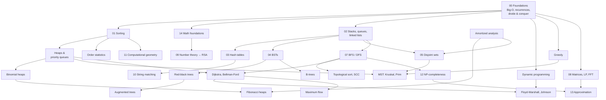

# Algorithms & Data Structures

A complete, beginner-to-advanced learning repository for **Algorithms, Data Structures and Design & Analysis of Algorithms (DAA)**, organised around the table of contents of *Introduction to Algorithms* (Cormen, Leiserson, Rivest and Stein, **CLRS, 2nd edition**).

Every topic page explains **what** an algorithm is, **why** it's needed, **how** it works internally, **how to implement it in Java**, **how fast it runs and how much memory it uses** (with derivations, not just Big-O labels), and **when to use it**. Each page ends with exercises, interview questions and revision notes.

> **Progress:** this repository is being built in batches. Pages marked **⬜ Not started** are placeholders for later batches. See the [syllabus checklist](16-Progress-Tracker/syllabus-checklist.md) for the live status of every topic.

---

## Contents

1. [How to use this repository](#how-to-use-this-repository)
2. [Prerequisites](#prerequisites)
3. [Table of contents](#table-of-contents)
4. [Topic dependency map](#topic-dependency-map)
5. [Recommended study order](#recommended-study-order)
6. [How every topic page is structured](#how-every-topic-page-is-structured)
7. [Tracking your progress](#tracking-your-progress)
8. [Revising before interviews](#revising-before-interviews)
9. [Running the Java code](#running-the-java-code)
10. [Notes on the textbook edition](#notes-on-the-textbook-edition)

---

## How to use this repository

1. **Start with [00-Foundations](00-Foundations/).** Everything else uses its vocabulary: Big-O, recurrences, divide and conquer.
2. **Follow the [study order](#recommended-study-order).** Each section lists its prerequisites at the top.
3. **For each topic:** read the intuition, trace the worked example by hand, *then* read the Java code, type it out yourself and run it.
4. **Do the exercises** at the end of each page before moving on. The quiz answers are hidden under a separate heading.
5. **Update the [progress tracker](16-Progress-Tracker/syllabus-checklist.md)** as you go.

## Prerequisites

| You should know | Why | Where to refresh |
|---|---|---|
| Basic Java: classes, arrays, loops, recursion, `ArrayList` | All implementations are in Java | Any Java tutorial |
| School algebra: exponents, logarithms | Complexity uses log₂ n, n², 2ⁿ | [Asymptotic notation](00-Foundations/asymptotic-notation.md) |
| Summations such as 1 + 2 + … + n | Analysing nested loops | [Summations](14-Mathematical-Foundations/summations.md) |
| Basic probability: expected value | Randomised algorithms (quicksort, hashing) | [Probability](14-Mathematical-Foundations/probability.md), [Distributions guide](../distribution/README.md) |
| Proof by induction | Correctness proofs and loop invariants | [Algorithm basics](00-Foundations/algorithm-basics.md#d-algorithm-and-pseudocode) |

**Prerequisites for advanced topics:**

| Advanced topic | Learn first |
|---|---|
| Red-black trees, B-trees | BSTs, rotations, asymptotic analysis |
| Fibonacci heaps | Binary heaps, linked lists, amortized analysis (potential method) |
| Union by rank + path compression | Disjoint-set forests, amortized analysis |
| Dijkstra, Prim | BFS, priority queues (heaps) |
| Kruskal | Sorting, disjoint sets |
| Maximum flow | BFS/DFS, shortest paths |
| Linear programming, simplex | Matrices, solving linear equations |
| FFT | Complex numbers, divide and conquer, recurrences |
| RSA, primality testing | GCD, modular arithmetic, modular exponentiation |
| NP-completeness | Polynomial time, reductions, graph algorithms |
| Approximation algorithms | NP-completeness, greedy algorithms, linear programming |

---

## Table of contents

Legend: ✅ written in full · ⬜ not started (placeholder). The checklist has the detailed per-topic status.

### [00 · Foundations](00-Foundations/)
| Topic | Status |
|---|---|
| [Algorithm basics](00-Foundations/algorithm-basics.md) | ✅ |
| [Time complexity](00-Foundations/time-complexity.md) | ✅ |
| [Space complexity](00-Foundations/space-complexity.md) | ✅ |
| [Asymptotic notation (O, Ω, Θ)](00-Foundations/asymptotic-notation.md) | ✅ |
| [Recurrence relations](00-Foundations/recurrence-relations.md) | ✅ |
| [Divide and conquer](00-Foundations/divide-and-conquer.md) | ✅ |

### [01 · Sorting and Order Statistics](01-Sorting-and-Order-Statistics/) (CLRS Part II)
| Group | Topics | Status |
|---|---|---|
| Comparison sorts (foundational) | [Bubble](01-Sorting-and-Order-Statistics/comparison-sorts/bubble-sort.md) · [Selection](01-Sorting-and-Order-Statistics/comparison-sorts/selection-sort.md) · [Insertion](01-Sorting-and-Order-Statistics/comparison-sorts/insertion-sort.md) · [Merge](01-Sorting-and-Order-Statistics/comparison-sorts/merge-sort.md) | ✅ |
| Ch. 6 Heapsort | [Heaps](01-Sorting-and-Order-Statistics/heapsort/heap-basics.md) · [Max-heapify](01-Sorting-and-Order-Statistics/heapsort/maintaining-heap-property.md) · [Build-heap](01-Sorting-and-Order-Statistics/heapsort/building-a-heap.md) · [Heapsort](01-Sorting-and-Order-Statistics/heapsort/heapsort.md) · [Priority queues](01-Sorting-and-Order-Statistics/heapsort/priority-queues.md) | ✅ |
| Ch. 7 Quicksort | [Basics](01-Sorting-and-Order-Statistics/quicksort/quicksort-basics.md) · [Partitioning](01-Sorting-and-Order-Statistics/quicksort/partitioning.md) · [Randomized](01-Sorting-and-Order-Statistics/quicksort/randomized-quicksort.md) · [Analysis](01-Sorting-and-Order-Statistics/quicksort/complexity-analysis.md) | ✅ |
| Ch. 8 Linear-time sorting | [Lower bounds](01-Sorting-and-Order-Statistics/linear-time-sorting/lower-bounds.md) · [Counting](01-Sorting-and-Order-Statistics/linear-time-sorting/counting-sort.md) · [Radix](01-Sorting-and-Order-Statistics/linear-time-sorting/radix-sort.md) · [Bucket](01-Sorting-and-Order-Statistics/linear-time-sorting/bucket-sort.md) | ✅ |
| Ch. 9 Order statistics | [Min & max](01-Sorting-and-Order-Statistics/order-statistics/minimum-and-maximum.md) · [Quickselect](01-Sorting-and-Order-Statistics/order-statistics/quickselect.md) · [Median of medians](01-Sorting-and-Order-Statistics/order-statistics/median-of-medians.md) | ✅ |

### 02 · Elementary Data Structures (CLRS Ch. 10)
[Stacks](02-Elementary-Data-Structures/stacks.md) · [Queues](02-Elementary-Data-Structures/queues.md) · [Linked lists](02-Elementary-Data-Structures/linked-lists.md) · [Pointers and objects](02-Elementary-Data-Structures/pointers-and-objects.md) · [Rooted trees](02-Elementary-Data-Structures/rooted-trees.md) · ⬜

### 03 · Hash Tables (CLRS Ch. 11)
[Direct addressing](03-Hash-Tables/direct-addressing.md) · [Hash tables](03-Hash-Tables/hash-tables-basics.md) · [Hash functions](03-Hash-Tables/hash-functions.md) · [Chaining](03-Hash-Tables/collision-resolution.md) · [Open addressing](03-Hash-Tables/open-addressing.md) · [Perfect hashing](03-Hash-Tables/perfect-hashing.md) · ⬜

### 04 · Trees (CLRS Ch. 12–14, 18–20)
| Group | Topics | Status |
|---|---|---|
| Binary search trees (Ch. 12) | [Basics](04-Trees/binary-search-trees/bst-basics.md) · [Searching](04-Trees/binary-search-trees/searching.md) · [Insertion](04-Trees/binary-search-trees/insertion.md) · [Deletion](04-Trees/binary-search-trees/deletion.md) · [Randomized BSTs](04-Trees/binary-search-trees/randomized-bsts.md) | ⬜ |
| Red-black trees (Ch. 13) | [Properties](04-Trees/red-black-trees/properties.md) · [Rotations](04-Trees/red-black-trees/rotations.md) · [Insertion](04-Trees/red-black-trees/insertion.md) · [Deletion](04-Trees/red-black-trees/deletion.md) | ⬜ |
| Augmenting (Ch. 14) | [Order-statistic trees](04-Trees/augmented-data-structures/order-statistics-trees.md) · [How to augment](04-Trees/augmented-data-structures/augmentation-methods.md) · [Interval trees](04-Trees/augmented-data-structures/interval-trees.md) | ⬜ |
| B-trees (Ch. 18) | [Structure](04-Trees/b-trees/structure.md) · [Operations](04-Trees/b-trees/operations.md) · [Deletion](04-Trees/b-trees/deletion.md) | ⬜ |
| Binomial heaps (Ch. 19) | [Binomial trees](04-Trees/binomial-heaps/binomial-trees.md) · [Operations](04-Trees/binomial-heaps/operations.md) | ⬜ |
| Fibonacci heaps (Ch. 20) | [Structure](04-Trees/fibonacci-heaps/structure.md) · [Mergeable-heap ops](04-Trees/fibonacci-heaps/mergeable-heap-operations.md) · [Decrease-key & delete](04-Trees/fibonacci-heaps/decrease-key-and-deletion.md) · [Degree bound](04-Trees/fibonacci-heaps/degree-analysis.md) | ⬜ |

### 05 · Disjoint Sets (CLRS Ch. 21)
[Operations](05-Disjoint-Sets/disjoint-set-operations.md) · [Linked-list representation](05-Disjoint-Sets/linked-list-representation.md) · [Forests](05-Disjoint-Sets/disjoint-set-forests.md) · [Union by rank + path compression](05-Disjoint-Sets/union-by-rank-and-path-compression.md) · ⬜

### 06 · Algorithm Design Techniques (CLRS Ch. 15–17)
| Group | Topics | Status |
|---|---|---|
| Dynamic programming (Ch. 15) | [Fundamentals](06-Algorithm-Design-Techniques/dynamic-programming/fundamentals.md) · [Assembly-line](06-Algorithm-Design-Techniques/dynamic-programming/assembly-line-scheduling.md) · [Matrix-chain](06-Algorithm-Design-Techniques/dynamic-programming/matrix-chain-multiplication.md) · [Elements of DP](06-Algorithm-Design-Techniques/dynamic-programming/optimal-substructure.md) · [LCS](06-Algorithm-Design-Techniques/dynamic-programming/longest-common-subsequence.md) · [Optimal BSTs](06-Algorithm-Design-Techniques/dynamic-programming/optimal-binary-search-trees.md) | ⬜ |
| Greedy (Ch. 16) | [Fundamentals](06-Algorithm-Design-Techniques/greedy-algorithms/fundamentals.md) · [Activity selection](06-Algorithm-Design-Techniques/greedy-algorithms/activity-selection.md) · [Greedy-choice property](06-Algorithm-Design-Techniques/greedy-algorithms/greedy-choice-property.md) · [Huffman](06-Algorithm-Design-Techniques/greedy-algorithms/huffman-coding.md) · [Task scheduling](06-Algorithm-Design-Techniques/greedy-algorithms/task-scheduling.md) | ⬜ |
| Amortized analysis (Ch. 17) | [Aggregate](06-Algorithm-Design-Techniques/amortized-analysis/aggregate-method.md) · [Accounting](06-Algorithm-Design-Techniques/amortized-analysis/accounting-method.md) · [Potential](06-Algorithm-Design-Techniques/amortized-analysis/potential-method.md) · [Dynamic tables](06-Algorithm-Design-Techniques/amortized-analysis/dynamic-tables.md) | ⬜ |

### 07 · Graph Algorithms (CLRS Ch. 22–26)
| Group | Topics | Status |
|---|---|---|
| Elementary (Ch. 22) | [Representations](07-Graph-Algorithms/graph-representations.md) · [BFS](07-Graph-Algorithms/bfs.md) · [DFS](07-Graph-Algorithms/dfs.md) · [Topological sort](07-Graph-Algorithms/topological-sorting.md) · [SCCs](07-Graph-Algorithms/strongly-connected-components.md) | ⬜ |
| MST (Ch. 23) | [Fundamentals](07-Graph-Algorithms/minimum-spanning-trees/fundamentals.md) · [Kruskal](07-Graph-Algorithms/minimum-spanning-trees/kruskal.md) · [Prim](07-Graph-Algorithms/minimum-spanning-trees/prim.md) | ⬜ |
| Shortest paths (Ch. 24–25) | [Fundamentals](07-Graph-Algorithms/shortest-paths/fundamentals.md) · [Bellman-Ford](07-Graph-Algorithms/shortest-paths/bellman-ford.md) · [DAG](07-Graph-Algorithms/shortest-paths/dag-shortest-paths.md) · [Dijkstra](07-Graph-Algorithms/shortest-paths/dijkstra.md) · [Floyd-Warshall](07-Graph-Algorithms/shortest-paths/floyd-warshall.md) · [Johnson](07-Graph-Algorithms/shortest-paths/johnson-algorithm.md) | ⬜ |
| Maximum flow (Ch. 26) | [Flow networks](07-Graph-Algorithms/maximum-flow/flow-networks.md) · [Ford-Fulkerson](07-Graph-Algorithms/maximum-flow/ford-fulkerson.md) · [Edmonds-Karp](07-Graph-Algorithms/maximum-flow/edmonds-karp.md) · [Bipartite matching](07-Graph-Algorithms/maximum-flow/bipartite-matching.md) · [Push-relabel](07-Graph-Algorithms/maximum-flow/push-relabel.md) · [Relabel-to-front](07-Graph-Algorithms/maximum-flow/relabel-to-front.md) | ⬜ |

### 08 · Advanced Algorithm Topics (CLRS Ch. 27–30)
| Group | Topics | Status |
|---|---|---|
| Sorting networks (Ch. 27) | [Comparison networks](08-Advanced-Algorithm-Topics/sorting-networks/comparison-networks.md) · [0-1 principle](08-Advanced-Algorithm-Topics/sorting-networks/zero-one-principle.md) · [Bitonic](08-Advanced-Algorithm-Topics/sorting-networks/bitonic-sorting.md) · [Merging](08-Advanced-Algorithm-Topics/sorting-networks/merging-networks.md) · [Sorting network](08-Advanced-Algorithm-Topics/sorting-networks/sorting-networks.md) | ⬜ |
| Matrix operations (Ch. 28) | [Properties](08-Advanced-Algorithm-Topics/matrix-operations/matrix-properties.md) · [Strassen](08-Advanced-Algorithm-Topics/matrix-operations/strassens-algorithm.md) · [Linear equations](08-Advanced-Algorithm-Topics/matrix-operations/solving-linear-equations.md) · [Inversion](08-Advanced-Algorithm-Topics/matrix-operations/matrix-inversion.md) · [Positive-definite](08-Advanced-Algorithm-Topics/matrix-operations/positive-definite-matrices.md) | ⬜ |
| Linear programming (Ch. 29) | [Standard & slack forms](08-Advanced-Algorithm-Topics/linear-programming/standard-and-slack-forms.md) · [Formulation](08-Advanced-Algorithm-Topics/linear-programming/formulation.md) · [Simplex](08-Advanced-Algorithm-Topics/linear-programming/simplex-algorithm.md) · [Duality](08-Advanced-Algorithm-Topics/linear-programming/duality.md) · [Initial feasible solution](08-Advanced-Algorithm-Topics/linear-programming/initial-feasible-solution.md) | ⬜ |
| Polynomials & FFT (Ch. 30) | [Representation](08-Advanced-Algorithm-Topics/polynomials-and-fft/polynomial-representation.md) · [DFT & FFT](08-Advanced-Algorithm-Topics/polynomials-and-fft/dft-and-fft.md) · [Efficient FFT](08-Advanced-Algorithm-Topics/polynomials-and-fft/efficient-fft.md) | ⬜ |

### 09 · Number-Theoretic Algorithms (CLRS Ch. 31)
[Basics](09-Number-Theoretic-Algorithms/number-theory-basics.md) · [GCD](09-Number-Theoretic-Algorithms/gcd-euclidean-algorithm.md) · [Modular arithmetic](09-Number-Theoretic-Algorithms/modular-arithmetic.md) · [Modular linear equations](09-Number-Theoretic-Algorithms/modular-linear-equations.md) · [CRT](09-Number-Theoretic-Algorithms/chinese-remainder-theorem.md) · [Modular exponentiation](09-Number-Theoretic-Algorithms/modular-exponentiation.md) · [RSA](09-Number-Theoretic-Algorithms/rsa-public-key-cryptosystem.md) · [Primality testing](09-Number-Theoretic-Algorithms/primality-testing.md) · [Factorization](09-Number-Theoretic-Algorithms/integer-factorization.md) · ⬜

### 10 · String Matching (CLRS Ch. 32)
[Naive](10-String-Matching/naive-string-matching.md) · [Rabin-Karp](10-String-Matching/rabin-karp.md) · [Finite automata](10-String-Matching/finite-automata-matching.md) · [KMP](10-String-Matching/knuth-morris-pratt.md) · ⬜

### 11 · Computational Geometry (CLRS Ch. 33)
[Segment properties](11-Computational-Geometry/line-segment-properties.md) · [Segment intersection](11-Computational-Geometry/segment-intersection.md) · [Convex hull](11-Computational-Geometry/convex-hull.md) · [Closest pair](11-Computational-Geometry/closest-pair-of-points.md) · ⬜

### 12 · Complexity Theory (CLRS Ch. 34)
[Polynomial time](12-Complexity-Theory/polynomial-time.md) · [Verification](12-Complexity-Theory/polynomial-time-verification.md) · [P vs NP](12-Complexity-Theory/p-vs-np.md) · [Reductions](12-Complexity-Theory/np-hardness-and-reductions.md) · [NP-completeness proofs](12-Complexity-Theory/np-completeness-proofs.md) · [Classic problems](12-Complexity-Theory/classic-np-complete-problems.md) · ⬜

### 13 · Approximation and Randomization (CLRS Ch. 35)
[Fundamentals](13-Approximation-and-Randomization/approximation-fundamentals.md) · [Vertex cover](13-Approximation-and-Randomization/vertex-cover.md) · [TSP](13-Approximation-and-Randomization/traveling-salesperson.md) · [Set cover](13-Approximation-and-Randomization/set-cover.md) · [Randomized algorithms](13-Approximation-and-Randomization/randomized-algorithms.md) · [LP approaches](13-Approximation-and-Randomization/linear-programming-approaches.md) · [Subset sum](13-Approximation-and-Randomization/subset-sum.md) · ⬜

### 14 · Mathematical Foundations (CLRS Appendices A–C)
[Summations](14-Mathematical-Foundations/summations.md) · [Bounding summations](14-Mathematical-Foundations/bounding-summations.md) · [Sets](14-Mathematical-Foundations/sets.md) · [Relations](14-Mathematical-Foundations/relations.md) · [Functions](14-Mathematical-Foundations/functions.md) · [Graphs](14-Mathematical-Foundations/graphs.md) · [Trees](14-Mathematical-Foundations/trees.md) · [Counting](14-Mathematical-Foundations/counting.md) · [Probability](14-Mathematical-Foundations/probability.md) · [Random variables](14-Mathematical-Foundations/random-variables.md) · [Distributions](14-Mathematical-Foundations/probability-distributions.md) · ⬜

### 15 · Practice and Revision
| Topic | Status |
|---|---|
| [Complexity comparison reference](15-Practice-and-Revision/complexity-comparison.md) | ✅ |
| [Algorithm comparisons](15-Practice-and-Revision/algorithm-comparisons.md) · [Interview questions](15-Practice-and-Revision/interview-questions.md) · [Coding problems](15-Practice-and-Revision/coding-problems.md) · [Common mistakes](15-Practice-and-Revision/common-mistakes.md) · [Revision notes](15-Practice-and-Revision/revision-notes.md) | ⬜ |

### [16 · Progress Tracker](16-Progress-Tracker/)
[Syllabus checklist](16-Progress-Tracker/syllabus-checklist.md) · [Weekly study plan](16-Progress-Tracker/weekly-study-plan.md) · [Completed topics](16-Progress-Tracker/completed-topics.md)

---

## Topic dependency map

An arrow A → B means "learn A before B".



## Recommended study order

| Phase | Weeks | Sections | Goal |
|---|---|---|---|
| **1. Foundations** | 1–2 | 00, 14 (summations, probability) | Analyse any loop or recursion |
| **2. Sorting** | 3–4 | 01 | Implement and analyse every major sort |
| **3. Core data structures** | 5–7 | 02, 03, 04 (BST, red-black), 05 | Know every operation's cost and invariant |
| **4. Design techniques** | 8–10 | 06 | Recognise DP and greedy problems |
| **5. Graphs** | 11–14 | 07 | BFS/DFS through max flow |
| **6. Advanced data structures** | 15–16 | 04 (B-trees, binomial and Fibonacci heaps, augmented trees) | Amortized structures |
| **7. Specialised algorithms** | 17–19 | 09, 10, 11, 08 | Number theory, strings, geometry, matrices, LP, FFT |
| **8. Theory** | 20–21 | 12, 13 | P vs NP, reductions, approximation |
| **9. Revision** | 22+ | 15 | Interview readiness |

The day-by-day version is in the [weekly study plan](16-Progress-Tracker/weekly-study-plan.md).

---

## How every topic page is structured

Every full topic page follows this template (adapted where a section doesn't apply):

| Section | Contents |
|---|---|
| **A. Introduction** | What it is, what problem it solves, real-world uses, prerequisites |
| **B. Intuition** | Plain-English idea with a real-world analogy, before any maths |
| **C. How it works internally** | Step-by-step trace on real input, intermediate states, diagrams, edge cases |
| **D. Algorithm and pseudocode** | CLRS-style pseudocode, line-by-line explanation, loop invariant or correctness proof |
| **E. Implementation** | Complete, compiled and tested Java with `main()`, a dry run, Java-specific notes and common bugs |
| **F. Time complexity** | Best, average and worst case (plus expected, if randomised), with step-by-step derivations and assumptions |
| **G. Space complexity** | Auxiliary space, recursion stack, in-place vs out-of-place |
| **H. Complexity summary** | A standard table (sorting, data structure or graph format) |
| **I. Advantages, limitations, comparisons** | When to use it and when not, practical performance, interview follow-ups |
| **J. Practice** | 3 beginner, 3 intermediate and 2 advanced exercises; 3 interview Q&As; a worked problem; named coding problems |
| **K. Revision notes** | 5 key takeaways, formulas, common mistakes, a quiz (answers in a separate section), related links |

**About coding-problem links:** problem *names* are given (for example "LeetCode 912 · Sort an Array"). Links are only included where the exact URL is certain. Anything else is marked *(verify link)* so you can confirm it yourself.

## Tracking your progress

Use the [syllabus checklist](16-Progress-Tracker/syllabus-checklist.md). Each topic has two status columns:

- **Content:** whether the repository page is written (✅ written / ⬜ not started).
- **My status:** your own learning progress. Change it as you go:

| Status | Meaning |
|---|---|
| `Not started` | Haven't opened it yet |
| `Learning` | Reading and tracing examples |
| `Implemented` | Wrote the Java code from memory, and it runs |
| `Practiced` | Solved the exercises and at least 2 coding problems |
| `Revised` | Reviewed the revision notes and quiz within the last 2 weeks |

Record finished topics with dates in [completed topics](16-Progress-Tracker/completed-topics.md).

## Revising before interviews

1. **One week before:** read [complexity-comparison.md](15-Practice-and-Revision/complexity-comparison.md) end to end, and be able to *derive* every entry, not just recite it.
2. **For each core topic** (sorting, hashing, BST/heap, BFS/DFS, Dijkstra, DP, greedy, union-find): re-read section K (revision notes) and redo the quiz without looking.
3. **Implement from memory, timed:** quicksort with partition, merge sort, heap operations, BFS, DFS, Dijkstra with `PriorityQueue`, union-find, and a 1-D and 2-D DP.
4. **Practise explaining aloud:** for every solution, state the time and space complexity *and why*.
5. **Review [common mistakes](15-Practice-and-Revision/common-mistakes.md):** off-by-one errors, integer overflow in `(lo + hi) / 2`, a recursion depth that's too deep, using Dijkstra with negative edges.

## Running the Java code

Every Java example is a complete program, and each one was compiled and run with **JDK 21** before being added. To run one:

```bash
# Save the code block as e.g. InsertionSort.java (the file name must match the public class), then:
java InsertionSort.java          # Java 11+ can run a single source file directly
# or the classic way:
javac InsertionSort.java && java InsertionSort
```

Run with `java -ea` to turn on the `assert` checks used in some examples.

## Notes on the textbook edition

Your table of contents is from the **2nd edition** of CLRS. Where newer editions (3rd 2009, 4th 2022) or modern practice differ, the topic page says so. The main differences:

| 2nd edition (this syllabus) | Newer editions / modern practice |
|---|---|
| 15.1 Assembly-line scheduling | Replaced by **rod cutting** in the 3rd edition. Both are covered as DP examples. |
| Ch. 19 Binomial heaps | Removed in the 3rd edition (now a problem). Still covered here for completeness. |
| Ch. 27 Sorting networks | Removed in the 3rd edition (replaced by multithreaded algorithms). |
| Hoare vs Lomuto partition | CLRS teaches Lomuto. Production libraries use Hoare-style or dual-pivot partitioning (Java's `Arrays.sort` for primitives). |
| Java's sorting | `Arrays.sort(int[])` uses dual-pivot quicksort; `Arrays.sort(Object[])` and `Collections.sort` use **TimSort** (a stable merge/insertion hybrid). |

---

This repository is part of [yanshuman/cryptography](../README.md). Questions or corrections: [open an issue](https://github.com/yanshuman/cryptography/issues).
