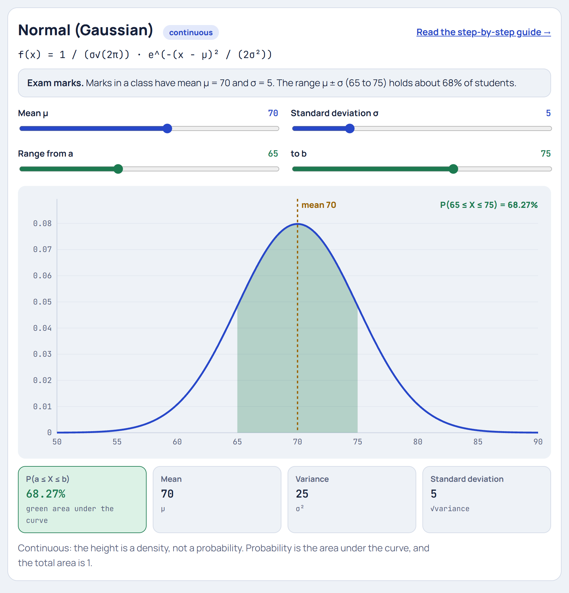

# Cryptography

Learning projects for cryptography and the maths behind it, built so every step can be seen and played with. Each project lives in its own folder with its own README.

## Projects

| Project | What it shows | Guide | Live demo |
|---|---|---|---|
| [RSA](rsa/) | Key generation, encryption, decryption, digital signatures, and how an attacker would try to break it | [README](rsa/README.md) | [Open](https://yanshuman.github.io/cryptography/rsa/) |
| [Elliptic Curves](elliptic-curves/) | Step-by-step path to elliptic-curve cryptography: the ellipse, then elliptic curves, point addition, finite fields, ECDH key exchange and attacks | [README](elliptic-curves/README.md) | [Ellipse Lab](https://yanshuman.github.io/cryptography/elliptic-curves/ellipse/) · [Elliptic Curve Lab](https://yanshuman.github.io/cryptography/elliptic-curves/elliptic-curve/) |
| [Probability Distributions](distribution/) | 10 distributions explained step by step (Bernoulli, Binomial, Poisson, Geometric, Uniform, Normal, Exponential, Log-normal, Chi-square, Student's t), each with a worked real-life example | [README](distribution/README.md) | [Distribution Explorer](https://yanshuman.github.io/cryptography/distribution/) |

| RSA | Elliptic Curves | Distributions |
|---|---|---|
| [](rsa/README.md) | [](elliptic-curves/README.md) | [](distribution/README.md) |

## How to run

Every project is plain HTML, CSS and JavaScript, with no installation or build step. Open the project's `index.html` in any browser, or use its live demo link above.

## Folder structure

```
cryptography/
├── README.md            # This index
├── rsa/                 # RSA: interactive lab, architecture diagram, guide
│   └── README.md
├── elliptic-curves/     # Elliptic curves section
│   ├── README.md
│   ├── ellipse/         # Ellipse guide + Ellipse Lab
│   └── elliptic-curve/  # Elliptic curve guide + lab, step-by-step, real-life example
└── distribution/        # Probability distributions: 10 step-by-step guides + Explorer
    └── README.md
```

## Questions

Open an issue on GitHub: https://github.com/yanshuman/cryptography/issues

## Note

These projects are for learning. For real-world security, use a well-tested library such as OpenSSL, Python's `cryptography`, or Go's standard crypto packages.
