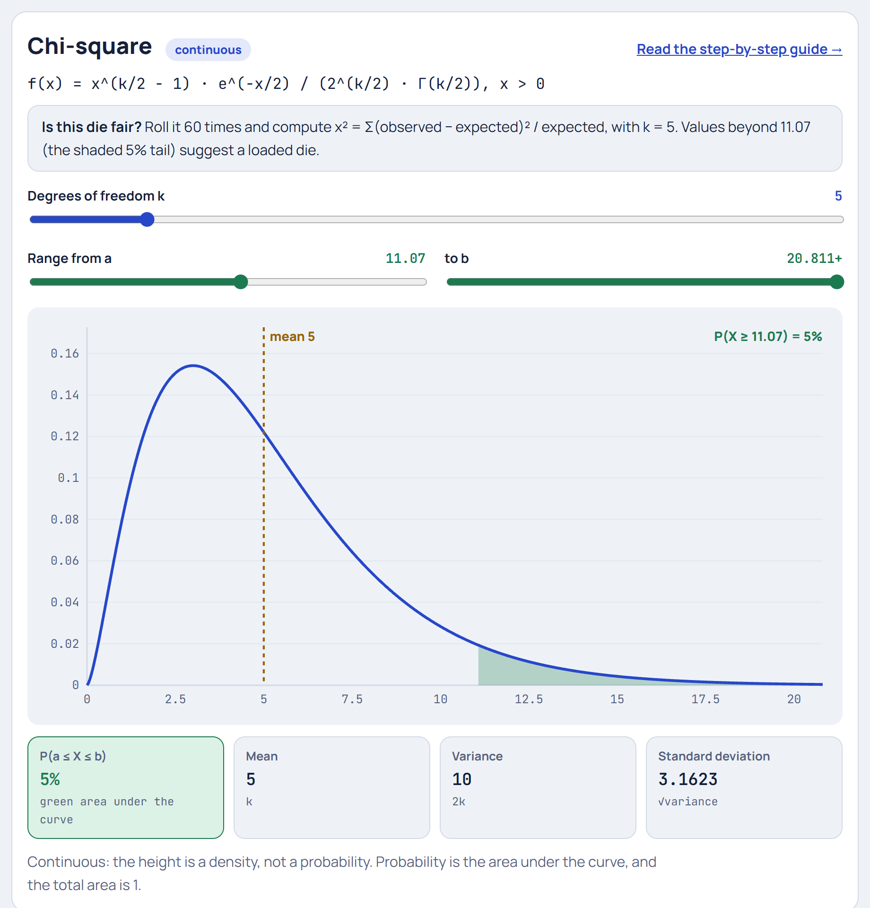

# Chi-square (χ²) Distribution

**[▶ Try it in the Distribution Explorer](https://yanshuman.github.io/cryptography/distribution/#chisq)** · [All distributions](README.md)

The Chi-square distribution answers: **"Is the difference between what I observed and what I expected just luck, or is something really going on?"** The running example is **testing whether a die is fair**.

| | |
|---|---|
| **Type** | Continuous (only values ≥ 0) |
| **Parameter** | k = degrees of freedom |
| **Formula** | f(x) = x^(k/2 − 1) · e^(−x/2) / (2^(k/2) · Γ(k/2)) |
| **Mean / Variance** | k / 2k |
| **Running example** | Roll a die 60 times and check the counts. Here k = 5 |

## Step 1: The picture in real life

You suspect a friend's die is loaded. You roll it **60 times**. If it's fair, each face should come up about 60 ÷ 6 = **10** times. You get:

| Face | 1 | 2 | 3 | 4 | 5 | 6 | Total |
|---|---|---|---|---|---|---|---|
| Observed O | 8 | 12 | 9 | 11 | 6 | 14 | 60 |
| Expected E | 10 | 10 | 10 | 10 | 10 | 10 | 60 |

The counts aren't exactly 10, but even a fair die won't give exactly 10 each time. **How far off is too far?** We need one number that measures "total surprise", and a distribution that tells us how big that number normally gets.

## Step 2: Build the "surprise score" χ²

For each face, compute (observed − expected)² ÷ expected:

| Face | O | E | O − E | (O − E)² | (O − E)² / E |
|---|---|---|---|---|---|
| 1 | 8 | 10 | −2 | 4 | 0.4 |
| 2 | 12 | 10 | +2 | 4 | 0.4 |
| 3 | 9 | 10 | −1 | 1 | 0.1 |
| 4 | 11 | 10 | +1 | 1 | 0.1 |
| 5 | 6 | 10 | −4 | 16 | 1.6 |
| 6 | 14 | 10 | +4 | 16 | 1.6 |
| | | | | **χ² =** | **4.2** |

> **χ² = Σ (O − E)² / E = 4.2**

**Why each piece?**
- **O − E:** how far off each count is.
- **Squared:** so that +4 and −4 both count as surprise and don't cancel (the same reason as for variance).
- **÷ E:** being 4 off matters more when you expected 10 than when you expected 1000. Dividing by E puts every category on a fair scale.

## Step 3: Where the distribution comes from

For counts, the natural random wobble is about √E. So each (O − E)/√E behaves roughly like a **z-score**, a standard [Normal](normal.md) value. Our statistic is then a **sum of squared z-scores**:

> χ² ≈ z₁² + z₂² + … (one per category)

That's the definition:

> **If Z₁, …, Zₖ are independent standard normals, then Z₁² + Z₂² + … + Zₖ² follows a Chi-square distribution with k degrees of freedom.**

Since squares are never negative, χ² is never negative. Each z² averages 1, so the sum averages **k**.

## Step 4: Degrees of freedom: why k = 5, not 6

There are 6 faces, but the counts must add to 60. Once you know 5 of them, the sixth is forced (60 minus the rest). Only **5 counts are free to vary**:

> **degrees of freedom k = (number of categories) − 1 = 6 − 1 = 5**

## Step 5: The shape for k = 5

| χ² value | 1 | 3 | 5 | 8 | 11.07 |
|---|---|---|---|---|---|
| density f(x) | 0.081 | **0.154** | 0.122 | 0.055 | 0.019 |

- It **starts at 0**, rises to a **peak at k − 2 = 3**, then has a long right tail.
- **Mean = k = 5**, **variance = 2k = 10**.
- For large k it becomes bell-shaped (the CLT again). Try k = 30 in the Explorer.

The formula's pieces are an x^(k/2 − 1) part (which rises from 0), an e^(−x/2) part (the fading tail), and the constant 2^(k/2)Γ(k/2) that makes the total area 1. Γ is the gamma function, a smooth version of the factorial.

## Step 6: Make the decision

Statisticians choose a cut-off so that a **fair** die would only exceed it **5% of the time**. For k = 5, the area beyond **11.07** is exactly 5%: the shaded tail in the picture.

> Our χ² = **4.2**, well below 11.07.
> The area beyond 4.2 (the **p-value**) is **0.52**: a fair die gives a result at least this uneven 52% of the time.

**Conclusion:** no evidence the die is loaded. The variation is just normal luck.

**A really loaded die** gives counts like 5, 7, 6, 8, 9, 25:

> χ² = (25 + 9 + 16 + 4 + 1 + 225) / 10 = **28.0**, far beyond 11.07
> p-value ≈ **0.00004**, so a fair die would almost never do this. **The die is loaded.**

## Step 7: Critical values to remember (5% level)

| k | 1 | 2 | 3 | 4 | 5 | 10 |
|---|---|---|---|---|---|---|
| cut-off | 3.84 | 5.99 | 7.81 | 9.49 | **11.07** | 18.31 |

## Step 8: Summary

| Question | Answer |
|---|---|
| What is it? | The distribution of a sum of k squared standard normals |
| Main use | Measuring how far observed counts are from expected counts |
| Statistic | χ² = Σ (O − E)² / E |
| Degrees of freedom | categories − 1 (for a goodness-of-fit test) |
| Mean / Variance | k / 2k |
| Decision | χ² above the cut-off (11.07 for k = 5) means "not just luck" |

**Where it's used:** goodness-of-fit tests (is this die, coin or random number generator fair?), tests of independence in survey tables (is preference related to age group?), genetics (do offspring ratios match Mendel's 3 : 1?), A/B testing with several variants, confidence intervals for a variance, and quality control.

**One-line answer for exams:**
> "The Chi-square distribution with k degrees of freedom is the distribution of the sum of squares of k independent standard normal variables. It is used in the χ² test, χ² = Σ(O − E)²/E, to judge whether observed counts differ significantly from expected counts. Its mean is k and its variance is 2k."
