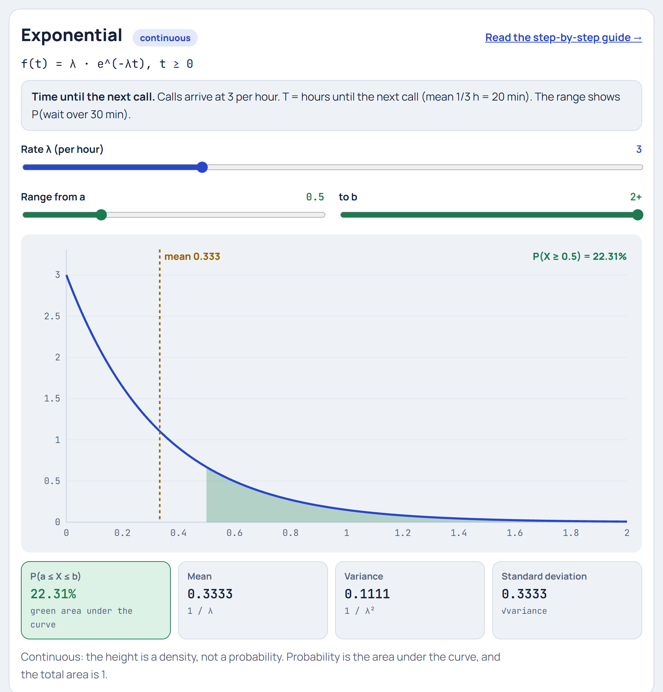

# Exponential Distribution

**[▶ Try it in the Distribution Explorer](https://yanshuman.github.io/cryptography/distribution/#exponential)** · [All distributions](README.md)

The Exponential distribution answers: **"How long until the next random event?"** It uses the same help desk as the [Poisson](poisson.md) guide (3 calls per hour), but now we measure the **waiting time between calls** instead of counting them.

| | |
|---|---|
| **Type** | Continuous (any time t ≥ 0) |
| **Parameter** | λ = rate of events (here per hour) |
| **Formula** | f(t) = λ · e^(−λt) for t ≥ 0 |
| **Mean / Variance** | 1/λ / 1/λ² |
| **Running example** | Calls arrive at λ = 3 per hour. T = hours until the next call. |

## Step 1: The picture in real life

The help desk gets **3 calls per hour** at random. A call just ended. How long until the phone rings again?

> **T = time until the next call** (in hours)

Usually it rings fairly soon, occasionally there's a long quiet stretch, and there's no upper limit. The graph starts **high at 0** and falls away smoothly, the opposite of a bell.

**Poisson vs Exponential:** same process, two questions.

| | Poisson | Exponential |
|---|---|---|
| Question | **How many** calls in an hour? | **How long** until the next call? |
| Type | Discrete count | Continuous time |
| Answer here | Average 3 calls | Average 1/3 hour = 20 minutes |

## Step 2: Where it comes from: "no calls yet"

The waiting time is longer than t hours **exactly when there are 0 calls in those t hours**. From the Poisson formula with rate 3t for a stretch of t hours:

> P(0 calls in t hours) = e^(−3t) × (3t)⁰ / 0! = e^(−3t)

So:

> **P(T > t) = e^(−λt)**

This "survival function" is the heart of the Exponential. For example:

> P(no call in the next 30 minutes) = P(T > 0.5) = e^(−3 × 0.5) = e^(−1.5) = **0.2231 (22.31%)**

## Step 3: The density formula

The chance of waiting **at most** t is the opposite:

> **F(t) = P(T ≤ t) = 1 − e^(−λt)**

The density f(t) is the slope of F(t) (its derivative):

> **f(t) = λ · e^(−λt)** = 3 · e^(−3t)

| Wait t | 0 | 10 min | 20 min | 30 min | 1 hour |
|---|---|---|---|---|---|
| t in hours | 0 | 0.167 | 0.333 | 0.5 | 1 |
| f(t) = 3e^(−3t) | **3.000** | 1.820 | 1.104 | 0.669 | 0.149 |

- **Highest at t = 0:** short waits are the most common.
- **Each extra 10 minutes multiplies the height by the same factor** (e^(−0.5) = 0.607). That steady decay is what "exponential" means.
- The height at 0 is 3, bigger than 1. That's fine: it's a density per hour, not a probability. The total area is still 1.

## Step 4: Probabilities of waits

| Question | Calculation | Answer |
|---|---|---|
| Next call within 10 minutes | 1 − e^(−3 × 1/6) = 1 − e^(−0.5) | **0.3935** |
| Next call within 20 minutes | 1 − e^(−1) | **0.6321** |
| Quiet for more than 30 minutes | e^(−1.5) | **0.2231** |
| Quiet for more than 1 hour | e^(−3) | **0.0498** |

The last one matches the Poisson guide's P(0 calls in an hour) = 0.0498. It's the same event seen two ways.

## Step 5: Mean, median and spread

> **Mean** = 1/λ = 1/3 hour = **20 minutes**
> **Standard deviation** = 1/λ = **20 minutes**. For the Exponential, the mean and standard deviation are always equal.
> **Median** = ln 2 / λ = 0.693 / 3 hours = **13.9 minutes**

**Why is the median smaller than the mean?** Half of all gaps are under 13.9 minutes, but a few very long quiet stretches pull the average up to 20. That's typical of **right-skewed** distributions.

## Step 6: The memoryless property

You've already waited 20 minutes with no call. What's the chance of waiting **another** 20 minutes?

> P(T > 40 min | T > 20 min) = P(T > 40) / P(T > 20) = e^(−2) / e^(−1) = e^(−1) = **0.368**

That's exactly the same as P(T > 20 min) for a fresh start, also e^(−1) = 0.368. **Time already waited tells you nothing about the time still to wait.**

> P(T > s + t | T > s) = P(T > t)

The Exponential is the **only** continuous distribution with this property. Its discrete twin is the [Geometric](geometric.md). It fits events with no "wear and tear": radioactive atoms don't age, and random calls don't become "due".

**When it doesn't fit:** a light bulb or car part *does* wear out, so its failure chance rises with age. Engineers then use the Weibull distribution instead.

## Step 7: Summary

| Question | Answer |
|---|---|
| What is it? | Waiting time until the next random event |
| Parameter | λ = event rate |
| Formula | f(t) = λe^(−λt), P(T > t) = e^(−λt) |
| Mean = SD | 1/λ = 20 minutes |
| Median | ln 2/λ ≈ 13.9 minutes |
| Partner | Poisson: counts per interval ↔ Exponential: gaps between events |
| Special property | Memoryless |

**Where it's used:** queueing (time between customers or server requests), telecoms (call lengths and gaps), reliability (time to failure of electronics without wear-out), radioactive decay (half-life = ln 2/λ), earthquake gaps, and survival analysis in medicine.

**One-line answer for exams:**
> "The Exponential distribution models the waiting time between independent random events occurring at constant rate λ: f(t) = λe^(−λt) and P(T > t) = e^(−λt). Its mean and standard deviation are both 1/λ, and it is the only memoryless continuous distribution."
