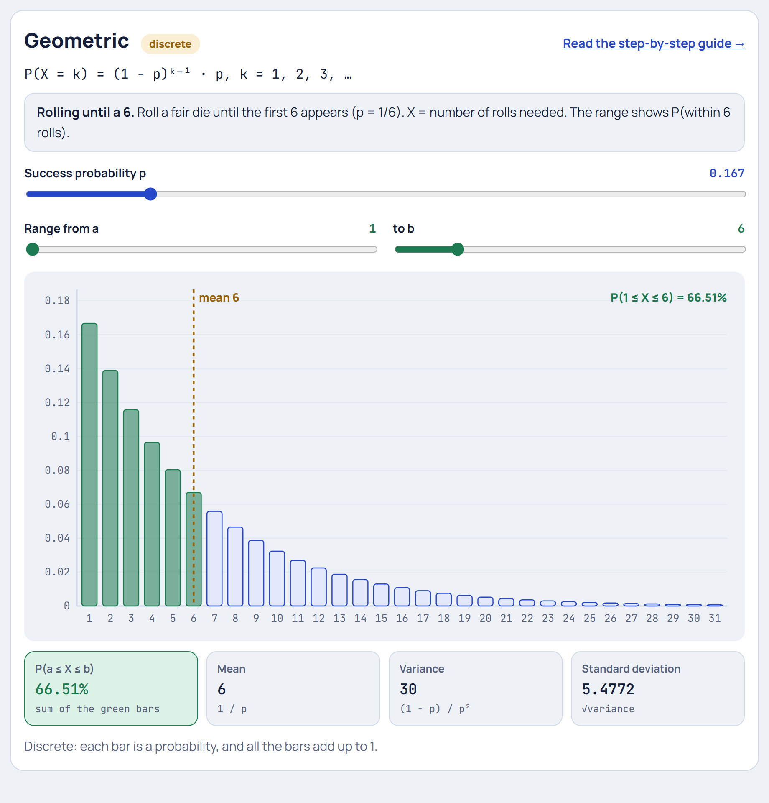

# Geometric Distribution

**[▶ Try it in the Distribution Explorer](https://yanshuman.github.io/cryptography/distribution/#geometric)** · [All distributions](README.md)

The Geometric distribution answers: **"How many tries until the first success?"** The running example is **rolling a die until you get a 6**, the classic board-game wait.

| | |
|---|---|
| **Type** | Discrete (1, 2, 3, … with no upper limit) |
| **Parameter** | p = probability of success on each try |
| **Formula** | P(X = k) = (1 − p)ᵏ⁻¹ · p |
| **Mean / Variance** | 1/p / (1 − p)/p² |
| **Running example** | Rolling a fair die until the first 6 (p = 1/6) |

## Step 1: The picture in real life

In many board games you need a 6 to start. You roll, and roll, and roll… How many rolls will it take?

> **X = number of rolls up to and including the first 6**

Sometimes the very first roll is a 6 (X = 1). Sometimes it takes 15 rolls. Each roll is a [Bernoulli](bernoulli.md) trial with p = 1/6, and you stop at the first success.

**Conditions:** independent tries, the same p every time, and you count until the **first** success.

## Step 2: The chance it takes exactly k rolls

For the first 6 to arrive on roll k, you need **k − 1 failures, then a success**.

**Exactly 3 rolls:** not 6, not 6, then a 6:

> (5/6) × (5/6) × (1/6) = 25 / 216 = **0.1157**

In general:

> **P(X = k) = (1 − p)ᵏ⁻¹ · p**

| Piece | Meaning | For k = 3 |
|---|---|---|
| (1 − p)ᵏ⁻¹ | k − 1 misses in a row | (5/6)² = 0.694 |
| p | then a success | 1/6 |

There's only **one** order here (all the misses must come first), so unlike the [Binomial](binomial.md) there's no "choose" term.

## Step 3: The whole distribution

| Rolls k | 1 | 2 | 3 | 4 | 5 | 6 | 7 | 8 | 9 | 10 |
|---|---|---|---|---|---|---|---|---|---|---|
| P(X = k) | 0.1667 | 0.1389 | 0.1157 | 0.0965 | 0.0804 | 0.0670 | 0.0558 | 0.0465 | 0.0388 | 0.0323 |

Each bar is **5/6 of the one before**, so the bars shrink by the same ratio each time. That's a *geometric sequence*, which is where the name comes from.

Surprising fact: **the single most likely outcome is k = 1**, a 6 on the very first roll, even though the average wait is 6 rolls.

## Step 4: "Within k tries" and "more than k tries"

The easiest way is through the opposite event. "No 6 in the first k rolls" means k misses in a row:

> **P(X > k) = (1 − p)ᵏ**

So:

> P(a 6 within 6 rolls) = 1 − (5/6)⁶ = 1 − 0.3349 = **0.6651 (66.51%)**
> P(still waiting after 10 rolls) = (5/6)¹⁰ = **0.1615 (16.15%)**

Many people think "6 rolls should be enough to get a 6". In fact, a third of the time it isn't.

## Step 5: The mean: 1/p, from a neat trick

Let E be the average number of rolls. On the first roll:
- with chance 1/6 you're done after **1** roll;
- with chance 5/6 you've used **1** roll and you're back where you started, needing E more on average.

> E = 1 + (5/6) × E → E − (5/6)E = 1 → (1/6)E = 1 → **E = 6**

In general, **mean = 1/p**. If something happens with chance 1 in 6, you wait 6 tries on average. If it's 1 in 100, you wait 100.

**Median:** the smallest k with P(X ≤ k) ≥ 0.5. Since 1 − (5/6)⁴ = 0.518, the median is **4 rolls**. Half the time you're done within 4, but a long tail of unlucky waits drags the mean up to 6.

## Step 6: Variance and standard deviation

> **Variance** = (1 − p) / p² = (5/6) / (1/36) = **30**
> **Standard deviation** = √30 ≈ **5.48** rolls

That's very spread out, about as large as the mean itself. Waiting times for rare events are unpredictable.

## Step 7: The memoryless property

Suppose you've already rolled 10 times with no 6. Are you "due" one?

**No.** The dice have no memory:

> P(need more than 3 more rolls | already failed 10) = P(more than 3 rolls from scratch) = (5/6)³ = **0.579**

Past failures don't change future chances. This is called the **memoryless property**. Believing otherwise is the **gambler's fallacy**. The Geometric is the only discrete distribution with this property. Its continuous twin is the [Exponential](exponential.md) distribution.

## Step 8: Summary

| Question | Answer |
|---|---|
| What is it? | Number of tries until the first success |
| Parameter | p = success chance per try |
| Formula | (1 − p)ᵏ⁻¹ p |
| Mean | 1/p = 6 |
| Variance | (1 − p)/p² = 30 |
| Handy shortcut | P(X > k) = (1 − p)ᵏ |
| Special property | Memoryless: past failures don't matter |

**Where it's used:** board games and gambling (rolls until a win), sales (calls until the first sale), reliability (days until the first failure), networking (retries until a packet gets through), cryptocurrency mining (attempts until a valid block), and "how many interviews until a job offer".

**One-line answer for exams:**
> "The Geometric distribution models the number of independent trials needed to get the first success, each with probability p: P(X = k) = (1 − p)ᵏ⁻¹p. Its mean is 1/p, its variance is (1 − p)/p², and it is memoryless."
