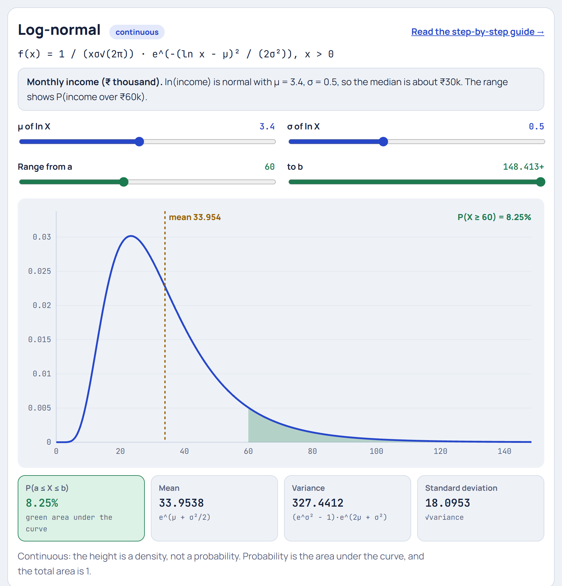

# Log-normal Distribution

**[▶ Try it in the Distribution Explorer](https://yanshuman.github.io/cryptography/distribution/#lognormal)** · [All distributions](README.md)

The Log-normal distribution appears when something **grows by percentages**: incomes, prices, populations, file sizes. Its logarithm is a [Normal](normal.md) bell. The running example is **monthly income**, measured in thousands of rupees (₹k).

| | |
|---|---|
| **Type** | Continuous (only positive values, x > 0) |
| **Parameters** | μ and σ = the mean and standard deviation **of ln X** (not of X itself) |
| **Formula** | f(x) = 1 / (xσ√(2π)) · e^(−(ln x − μ)² / (2σ²)) |
| **Mean / Median** | e^(μ + σ²/2) / e^μ |
| **Running example** | ln(income) is Normal with μ = 3.4, σ = 0.5 |

## Step 1: The picture in real life

Look at monthly incomes in a city:

- Most people earn a moderate amount, say ₹20k to ₹40k.
- Nobody earns less than ₹0.
- But a few earn ₹1 lakh, ₹5 lakh, or more: a **long tail to the right**.

That's not a symmetric bell. The graph is **lopsided**: it rises steeply from 0, peaks early, then trails off slowly to the right.

## Step 2: Why it happens: growth multiplies

The [Normal](normal.md) distribution appears when many small effects are **added**. Income grows by **multiplying**:

> salary × 1.10 (a 10% raise) × 1.05 (inflation bump) × 1.20 (a promotion) × 0.90 (a bad year) × …

A 10% raise on ₹1 lakh adds far more rupees than a 10% raise on ₹20k. Percentages compound, so the rich pull further and further ahead.

**The key trick: logarithms turn multiplication into addition.**

> ln(a × b × c) = ln a + ln b + ln c

So ln(income) is a **sum** of many small random effects, and by the Central Limit Theorem it forms a **bell curve**. That's the definition:

> **X is Log-normal when ln X is Normal.**

## Step 3: The parameters live on the log scale

For our city:

> ln(income) ~ Normal with **μ = 3.4** and **σ = 0.5**

These aren't rupees. They describe ln(income). To get back to rupees, use eˣ (the opposite of ln):

> e^3.4 = **29.96**, so about **₹30k**

Because the log scale is symmetric around μ, half the people have ln(income) below 3.4, so half earn below e^3.4. **The median income is e^μ ≈ ₹30k.**

## Step 4: The 68% range, stretched unevenly

On the log scale, 68% of people are within μ ± σ = 3.4 ± 0.5, that is between 2.9 and 3.9. Convert back:

> e^2.9 = **₹18.2k** and e^3.9 = **₹49.4k**

So 68% of people earn between ₹18.2k and ₹49.4k. Look at the distances from the median:

- down: 30 − 18.2 = **₹11.8k**
- up: 49.4 − 30 = **₹19.4k**

The range is **lopsided**: further to the right than to the left. Equal steps on the log scale become equal **ratios** in rupees: ×1.65 up, ÷1.65 down.

## Step 5: The formula, piece by piece

> f(x) = **1 / (x σ √(2π))** · **e^(−(ln x − μ)² / (2σ²))**

Compare with the [Normal](normal.md) formula:

| Piece | Normal | Log-normal |
|---|---|---|
| Distance from centre | x − μ | **ln x** − μ |
| Bell shape | e^(−(…)²/(2σ²)) | same |
| Height fix | 1 / (σ√(2π)) | 1 / (**x** σ√(2π)) |

**Where does the extra 1/x come from?** Stretching the axis from ln x back to x squeezes the small values together and spreads the big ones apart. To keep the total area at 1, the density must be divided by x. It's the "exchange rate" between the two scales.

## Step 6: Mode, median and mean: three different "centres"

| Centre | Formula | Value | Meaning |
|---|---|---|---|
| **Mode** (peak) | e^(μ − σ²) | **₹23.3k** | the most common income |
| **Median** | e^μ | **₹30.0k** | half earn less, half earn more |
| **Mean** (average) | e^(μ + σ²/2) | **₹34.0k** | total income ÷ number of people |

Always **mode < median < mean** for right-skewed data. A few very high earners pull the **average up**, which is why news reports often quote the **median** income: it describes a "typical" person better.

> Standard deviation = √((e^σ² − 1) · e^(2μ + σ²)) ≈ **₹18.1k**

## Step 7: Probabilities: convert to z on the log scale

**What share of people earn more than ₹60k?**

1. Take the log: ln 60 = **4.094**
2. Turn it into a z-score on the log scale: z = (4.094 − 3.4) / 0.5 = **1.389**
3. Look up the normal tail beyond z = 1.389: **0.0825**

So about **8.25%** earn over ₹60k, the shaded area in the picture.

**Less than ₹20k?** ln 20 = 2.996, z = (2.996 − 3.4) / 0.5 = −0.809, which gives **20.9%**.

The recipe is always the same: **take logs, then use the Normal**.

## Step 8: Summary

| Question | Answer |
|---|---|
| What is it? | A variable whose logarithm is Normal |
| Why does it appear? | Many small effects **multiply** (growth by percentages) |
| Parameters | μ, σ of ln X (here 3.4 and 0.5) |
| Shape | Positive only, right-skewed, long tail |
| Centres | mode ₹23.3k < median ₹30k < mean ₹34k |
| Probabilities | Take ln, then use z-scores |

**Where it's used:** incomes and wealth, stock prices (the Black–Scholes model assumes log-normal prices), city and company sizes, house prices, insurance claim sizes, response times of web servers, particle sizes in dust and sprays, rainfall amounts, and time to recover from an illness.

**One-line answer for exams:**
> "A random variable X is log-normally distributed if ln X is normally distributed with mean μ and standard deviation σ. It is positive and right-skewed, arises from multiplicative growth, and has median e^μ and mean e^(μ + σ²/2)."
