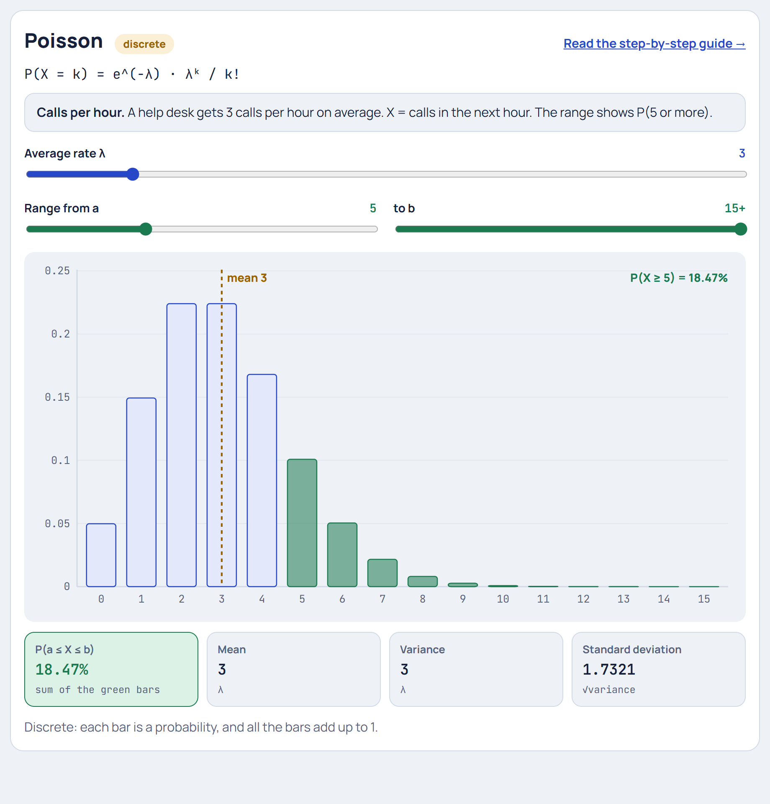

# Poisson Distribution

**[▶ Try it in the Distribution Explorer](https://yanshuman.github.io/cryptography/distribution/#poisson)** · [All distributions](README.md)

The Poisson distribution answers: **"How many times will something happen in a fixed time or space, when it happens at random at a known average rate?"** The running example is **calls arriving at a help desk**.

| | |
|---|---|
| **Type** | Discrete (0, 1, 2, … with no upper limit) |
| **Parameter** | λ (lambda) = average number of events per interval |
| **Formula** | P(X = k) = e^(−λ) · λᵏ / k! |
| **Mean / Variance** | λ / λ (they are equal) |
| **Running example** | A help desk gets 3 calls per hour on average (λ = 3) |

## Step 1: The picture in real life

A help desk receives **3 calls per hour on average**. Calls come in at random: nobody coordinates when to call. In the next hour, how many calls will arrive?

> **X = number of calls in the next hour**

It could be 0 (a quiet hour), 3 (typical) or 8 (a busy hour). Unlike the [Binomial](binomial.md), there's **no fixed number of trials** and no upper limit. The Poisson distribution, named after Siméon Denis Poisson (1837), gives the chance of each count.

**Conditions:**
- Events happen **one at a time**, at random.
- They're **independent**: one call doesn't make another more likely.
- The **average rate is constant** (3 per hour) across the interval.

## Step 2: Where it comes from: chop the hour into tiny pieces

Let's build it from things we already know. Split the hour into **60 minutes**. If 3 calls arrive per hour, the chance of a call in any one minute is about

> p = 3 / 60 = 0.05

Treat each minute as a [Bernoulli](bernoulli.md) trial (call or no call). Then the number of calls is a Binomial with n = 60, p = 0.05. But that isn't quite right, because two calls could land in the same minute. So chop finer, into **3600 seconds**, with p = 3/3600:

| k calls | Binomial, 60 minutes | Binomial, 3600 seconds | Limit (infinitely fine) |
|---|---|---|---|
| 0 | 0.0461 | 0.0497 | **0.0498** |
| 1 | 0.1455 | 0.1493 | **0.1494** |
| 2 | 0.2259 | 0.2241 | **0.2240** |
| 3 | 0.2298 | 0.2241 | **0.2240** |

As the pieces get smaller, the numbers settle down. The **limit** is the Poisson distribution: a Binomial with **n → ∞ and p → 0**, while n × p stays equal to λ = 3.

## Step 3: The formula, piece by piece

> **P(X = k) = e^(−λ) · λᵏ / k!**

Each piece comes from taking that limit of the Binomial formula:

| Piece | What it means | For λ = 3, k = 2 |
|---|---|---|
| **λᵏ** | k events, each "worth" λ (from pᵏ × n^k → λᵏ) | 3² = 9 |
| **k!** | the k calls can happen in any order, so divide out the orderings (from C(n, k)) | 2! = 2 |
| **e^(−λ)** | the chance of *no other* calls in the rest of the hour: (1 − λ/n)ⁿ → e^(−λ) as n → ∞ | e^(−3) = 0.0498 |

> P(X = 2) = 0.0498 × 9 / 2 = **0.2240**

**Why e?** The expression (1 − λ/n)ⁿ, "no event in any of n tiny pieces", gets closer and closer to e^(−λ) as n grows. That's one of the classic definitions of e ≈ 2.718.

## Step 4: The whole distribution

| Calls k | 0 | 1 | 2 | 3 | 4 | 5 | 6 | 7 | 8 | 9 | 10 |
|---|---|---|---|---|---|---|---|---|---|---|---|
| P(X = k) | 0.0498 | 0.1494 | 0.2240 | 0.2240 | 0.1680 | 0.1008 | 0.0504 | 0.0216 | 0.0081 | 0.0027 | 0.0008 |

Each value is the one before it times λ/k. For example, P(4) = P(3) × 3/4 = 0.2240 × 0.75 = 0.1680. This makes the table quick to build by hand.

Notice:
- **2 and 3 are tied** as the most likely counts. When λ is a whole number, k = λ − 1 and k = λ always tie.
- The shape is **skewed right**: it can't go below 0, but it has a long tail of busy hours.

## Step 5: Probabilities of ranges

> P(a quiet hour, no calls) = P(0) = e^(−3) = **0.0498**, about 1 hour in 20
> P(2 or fewer) = 0.0498 + 0.1494 + 0.2240 = **0.4232**
> P(5 or more) = 1 − P(0 to 4) = 1 − 0.8153 = **0.1847 (18.47%)**

So if one person can handle 4 calls per hour, they'll be overloaded in about **18% of hours**. That's exactly the kind of question Poisson is used for in staffing.

## Step 6: Mean and variance are both λ

> **Mean = λ = 3** calls per hour
> **Variance = λ = 3**, so the standard deviation is √3 ≈ **1.73**

This "mean = variance" property is the Poisson fingerprint. If you count events and find the variance is much larger than the mean, the events are probably **clumped** (not independent), and Poisson is the wrong model.

## Step 7: Changing the interval

λ scales with the size of the interval:

| Interval | λ | P(0 calls) |
|---|---|---|
| 20 minutes | 1 | e^(−1) = 0.368 |
| 1 hour | 3 | e^(−3) = 0.050 |
| 8-hour shift | 24 | e^(−24) ≈ 0 |

For large λ (about 20 or more) the Poisson looks like a [Normal](normal.md) with μ = λ and σ = √λ. Try λ = 20 in the Explorer.

**The link to waiting times:** if the *number* of calls per hour is Poisson(3), then the *time between* calls follows the [Exponential](exponential.md) distribution with an average gap of 1/3 hour = 20 minutes.

## Step 8: Summary

| Question | Answer |
|---|---|
| What is it? | Number of random events in a fixed interval |
| Parameter | λ = average count per interval |
| Formula | e^(−λ) λᵏ / k! |
| Mean = Variance | λ = 3 |
| Comes from | Binomial with n → ∞, p → 0, np = λ |
| Example result | P(no calls) = 4.98%, P(5 or more) = 18.47% |

**Where it's used:** call centres and server traffic (requests per second), website visits per minute, accidents at a junction per month, typos per page, radioactive decays per second, goals in a football match, mutations in a DNA strand, and customers arriving at a shop.

**One-line answer for exams:**
> "The Poisson distribution models the number of independent random events in a fixed interval with average rate λ: P(X = k) = e^(−λ)λᵏ/k!. Its mean and variance are both λ, and it is the limit of the Binomial when n is large and p is small."
