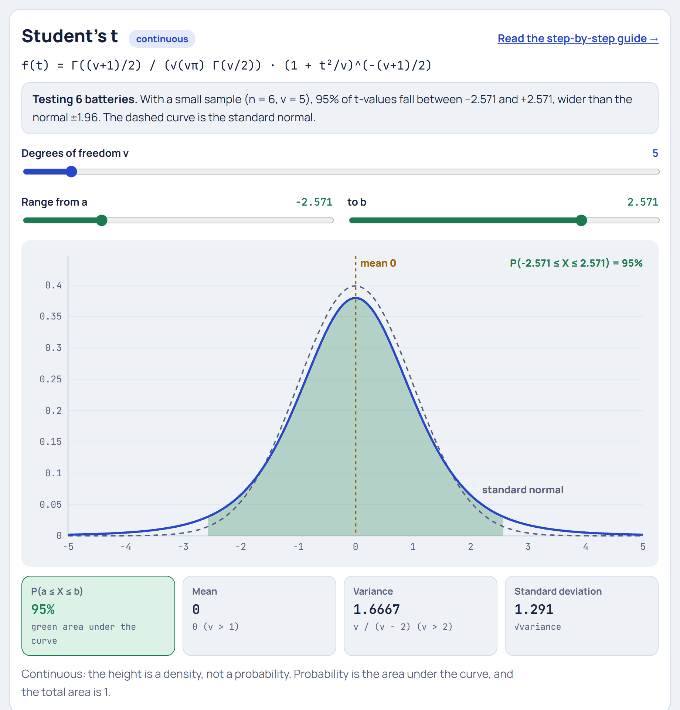

# Student's t Distribution

**[▶ Try it in the Distribution Explorer](https://yanshuman.github.io/cryptography/distribution/#t)** · [All distributions](README.md)

The t distribution is what the [Normal](normal.md) becomes when you **don't know the true standard deviation** and must estimate it from a **small sample**. The running example is **testing a battery maker's claim** with only 6 batteries.

| | |
|---|---|
| **Type** | Continuous, symmetric around 0 |
| **Parameter** | ν (nu) = degrees of freedom = n − 1 |
| **Formula** | f(t) = Γ((ν+1)/2) / (√(νπ) Γ(ν/2)) · (1 + t²/ν)^(−(ν+1)/2) |
| **Mean / Variance** | 0 / ν/(ν − 2) (for ν > 2) |
| **Running example** | 6 batteries, claimed life 10 hours, so ν = 5 |

## Step 1: The picture in real life

A company claims its batteries last **10 hours** on average. You can only afford to test **6**:

> 9.2, 9.8, 10.1, 9.5, 9.6, 9.4 hours

They seem a bit short. But with only 6 batteries, is that real, or just bad luck in which ones you picked?

## Step 2: The sample mean and standard deviation

**Mean:**

> (9.2 + 9.8 + 10.1 + 9.5 + 9.6 + 9.4) / 6 = 57.6 / 6 = **9.6 hours**

**Standard deviation** (the same steps as in the [Normal](normal.md) guide, but dividing by **n − 1 = 5**, because this is a sample):

| Battery | 9.2 | 9.8 | 10.1 | 9.5 | 9.6 | 9.4 |
|---|---|---|---|---|---|---|
| x − 9.6 | −0.4 | +0.2 | +0.5 | −0.1 | 0.0 | −0.2 |
| (x − 9.6)² | 0.16 | 0.04 | 0.25 | 0.01 | 0.00 | 0.04 |

> Sum of squares = **0.50**
> s² = 0.50 / 5 = 0.10, so **s = √0.10 = 0.316 hours**

## Step 3: How precise is the average? The standard error

A single battery wobbles by about s = 0.316. An **average of 6** wobbles less, by s/√n:

> **Standard error** SE = s / √n = 0.316 / √6 = 0.316 / 2.449 = **0.129 hours**

## Step 4: The t-statistic

How many standard errors is our average from the claimed 10?

> **t = (sample mean − claimed mean) / SE** = (9.6 − 10) / 0.129 = **−3.10**

This looks just like a z-score from the Normal guide, with one crucial difference: **we used s, an estimate, instead of the true σ**.

## Step 5: Why not just use the Normal? (the key idea)

With only 6 values, **s itself is uncertain**. By bad luck your sample might look unusually tight, making s too small and t too big. That extra uncertainty means extreme t-values happen **more often** than extreme z-values.

So the t distribution looks like a Normal but with **heavier tails** and a **lower peak**:

| | Standard normal | t with ν = 5 |
|---|---|---|
| Height at centre | 0.399 | 0.380 |
| P(beyond ±3) | 0.27% | **3.0%**, about 11 times more |
| 95% cut-off | ±1.96 | **±2.571** |

This was worked out in 1908 by William Gosset, a chemist at the **Guinness brewery** in Dublin who tested small batches of barley. Guinness didn't let staff publish under their own names, so he signed his paper **"Student"**, and the name stuck.

## Step 6: Degrees of freedom: the tails shrink as the sample grows

> **ν = n − 1 = 6 − 1 = 5**

(One degree is "used up" by computing the mean, for the same reason as in the [Chi-square](chi-square.md) guide.)

| ν (sample size − 1) | 1 | 2 | 5 | 10 | 30 | ∞ |
|---|---|---|---|---|---|---|
| 95% cut-off | 12.706 | 4.303 | **2.571** | 2.228 | 2.042 | **1.960** |

The more data you have, the better s estimates σ, and the closer t gets to the Normal. At ν = ∞ they're identical. Drag ν in the Explorer and watch the blue curve hug the dashed normal.

## Step 7: Make the decision

Our t = **−3.10**. For ν = 5, 95% of t-values from a true-10-hour battery would fall between −2.571 and +2.571.

> |−3.10| > 2.571, so the result is outside the usual range.
> The **p-value** (the chance of a t this extreme if the claim were true) is **0.027**, about 2.7%.

**Conclusion:** at the 5% level, the evidence says the batteries last **less than 10 hours**.

## Step 8: The confidence interval

A 95% range for the **true** average life:

> mean ± (cut-off × SE) = 9.6 ± 2.571 × 0.129 = 9.6 ± 0.332 → **9.27 to 9.93 hours**

The claimed 10 hours is **not inside** the interval, which agrees with Step 7.

If you had wrongly used the Normal's 1.96, you'd get 9.6 ± 0.253, an interval that is **too narrow** and overconfident. That's exactly the mistake the t distribution prevents.

## Step 9: Summary

| Question | Answer |
|---|---|
| What is it? | The distribution of (mean − μ) / (s/√n) when σ is unknown |
| When to use | Small samples (roughly n < 30) with σ estimated from the data |
| Shape | Like the Normal but with heavier tails |
| Parameter | ν = n − 1 |
| Cut-off (95%, ν = 5) | ±2.571 (vs ±1.96 for the Normal) |
| As ν → ∞ | Becomes the standard Normal |
| Example | t = −3.10, p = 0.027, CI 9.27 to 9.93 hours |

**Where it's used:** t-tests (does a new drug lower blood pressure? is class A's average different from class B's?), confidence intervals from small samples, A/B tests with few users, comparing before-and-after measurements (paired t-test), checking coefficients in linear regression, and quality control on small batches.

**One-line answer for exams:**
> "Student's t distribution with ν = n − 1 degrees of freedom describes the standardised sample mean t = (x̄ − μ)/(s/√n) when the population standard deviation is unknown. It is symmetric like the Normal but has heavier tails, and it approaches the standard Normal as ν grows."
