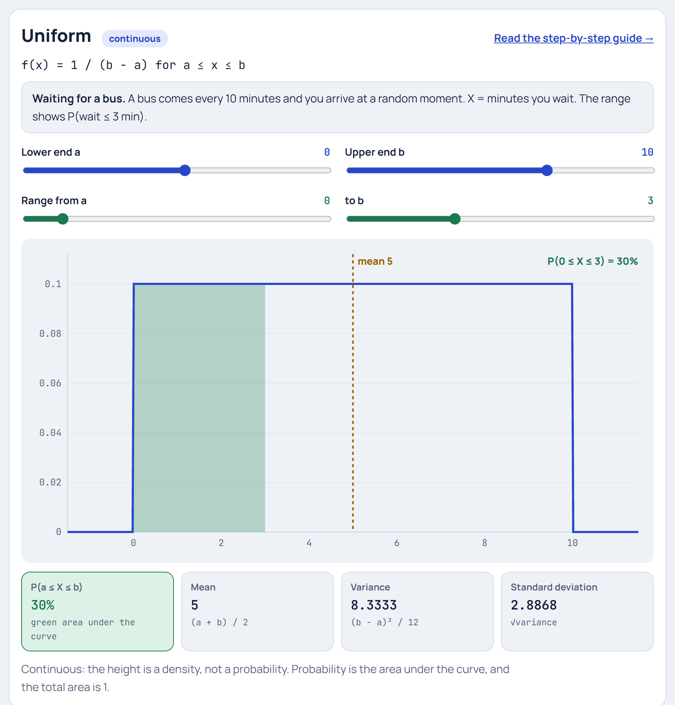

# Uniform Distribution

**[▶ Try it in the Distribution Explorer](https://yanshuman.github.io/cryptography/distribution/#uniform)** · [All distributions](README.md)

The Uniform distribution says: **"Every value in a range is equally likely."** It's the flattest, simplest distribution, and the starting point for how computers generate random numbers. The running example is **waiting for a bus**.

| | |
|---|---|
| **Type** | Continuous (any value between a and b); a discrete version also exists |
| **Parameters** | a = lowest value, b = highest value |
| **Formula** | f(x) = 1 / (b − a) for a ≤ x ≤ b, and 0 outside |
| **Mean / Variance** | (a + b)/2 / (b − a)²/12 |
| **Running example** | A bus comes every 10 minutes and you arrive at a random time, so your wait is between 0 and 10 minutes |

## Step 1: The picture in real life

A bus comes **exactly every 10 minutes**, and you walk to the stop without checking the timetable. Your wait could be anything from 0 minutes (it pulls up as you arrive) to almost 10 (you just missed it).

> **X = your waiting time in minutes**, somewhere between **a = 0** and **b = 10**

Since you arrive at a random moment, no wait time is more likely than any other. Waiting 2.3 minutes is just as likely as waiting 7.9. The graph is a **flat rectangle**.

## Step 2: How tall is the rectangle?

For any continuous distribution, the **total area under the curve must be 1** (100%: you're certain to wait *some* amount between 0 and 10).

A rectangle's area is width × height:

> width = b − a = 10 − 0 = 10
> 10 × height = 1 → height = **1/10 = 0.1**

That's the whole formula:

> **f(x) = 1 / (b − a) = 1 / 10 = 0.1** for 0 ≤ x ≤ 10, and 0 everywhere else

The height 0.1 isn't a probability. It's a **density**: "0.1 per minute". Probability only comes from multiplying by a width.

## Step 3: Probability = area = width × height

Because the graph is a rectangle, every probability is just a smaller rectangle:

> **P(c ≤ X ≤ d) = (d − c) / (b − a)**

| Question | Width | Probability |
|---|---|---|
| Wait 3 minutes or less | 3 − 0 = 3 | 3/10 = **0.30** |
| Wait between 4 and 6 minutes | 6 − 4 = 2 | 2/10 = **0.20** |
| Wait more than 8 minutes | 10 − 8 = 2 | 2/10 = **0.20** |
| Wait exactly 5.000… minutes | 0 | **0** |

The last row matters: for a continuous variable, a **single exact value has probability 0**, because it has no width. Only ranges have probability.

## Step 4: The cumulative distribution (CDF)

"What's the chance I wait **at most** x minutes?"

> **F(x) = P(X ≤ x) = (x − a) / (b − a)** = x / 10

| x (minutes) | 0 | 2 | 5 | 8 | 10 |
|---|---|---|---|---|---|
| F(x) | 0 | 0.2 | 0.5 | 0.8 | 1 |

It's a straight line rising from 0 to 1. Every other distribution's CDF is some curve, but the Uniform's is perfectly straight.

## Step 5: The mean

The rectangle balances in its middle:

> **Mean = (a + b) / 2** = (0 + 10) / 2 = **5 minutes**

On average you wait half the gap between buses.

## Step 6: The variance: where does the "12" come from?

> **Variance = (b − a)² / 12** = 100 / 12 = **8.33**, so **σ ≈ 2.89 minutes**

**Where does 12 come from?** Use variance = (average of X²) − (mean)²:

- Average of X²: ∫₀¹⁰ x² × (1/10) dx = (1/10) × (10³/3) = 1000/30 = **33.33**
- Mean squared: 5² = **25**
- Variance = 33.33 − 25 = **8.33** ✓

Doing the same calculation with general a and b always simplifies to (b − a)²/12.

## Step 7: The discrete uniform: a fair die

When only whole values are possible, each of the n values gets probability **1/n**. A fair die is the classic case:

| Face | 1 | 2 | 3 | 4 | 5 | 6 |
|---|---|---|---|---|---|---|
| Probability | 1/6 | 1/6 | 1/6 | 1/6 | 1/6 | 1/6 |

> Mean = (1 + 6) / 2 = **3.5**
> Variance = (n² − 1)/12 = 35/12 ≈ **2.92**

Other examples: a roulette wheel, drawing one card from a shuffled deck, picking a random lottery ball.

## Step 8: Why computers love the uniform

When you call `Math.random()` in JavaScript or `random.random()` in Python, you get a **Uniform(0, 1)** number. Every other distribution in this folder can be made from it:

| Want | Recipe using a uniform U |
|---|---|
| [Bernoulli](bernoulli.md)(p) | 1 if U < p, else 0 |
| [Exponential](exponential.md)(λ) | −ln(U) / λ |
| [Normal](normal.md)(0, 1) | √(−2 ln U₁) · cos(2πU₂) (the Box–Muller method) |

This is called **inverse transform sampling**. So the humble flat rectangle is the seed of all computer simulation.

## Step 9: Summary

| Question | Answer |
|---|---|
| What is it? | Every value between a and b is equally likely |
| Shape | Flat rectangle, height 1/(b − a) |
| Probability | (width of range) / (b − a) |
| Mean | (a + b)/2 = 5 |
| Variance | (b − a)²/12 = 8.33 |
| Discrete version | Each of n values has probability 1/n (a die: mean 3.5) |

**Where it's used:** random number generators and simulations, rounding errors (between −0.5 and +0.5 of the last digit), arrival times when nothing is scheduled, random sampling and shuffling, fair games (dice, roulette, lotteries), and as a "no preference" starting assumption in statistics.

**One-line answer for exams:**
> "The Uniform distribution on [a, b] gives every value in the interval the same density 1/(b − a), so probabilities are proportional to interval length. Its mean is (a + b)/2 and its variance is (b − a)²/12."
