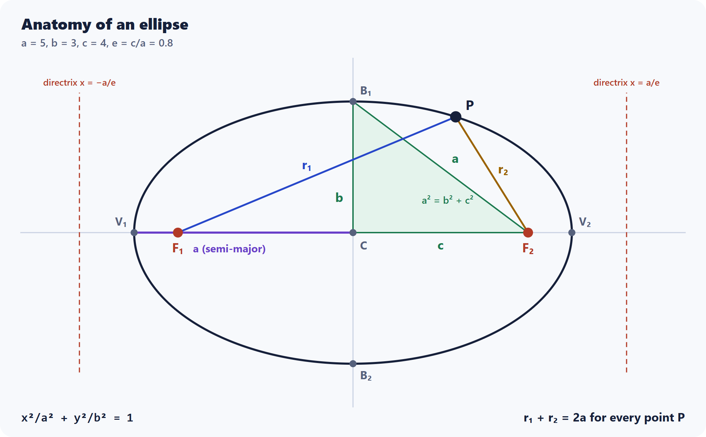

# Elliptic Curves

Elliptic-curve cryptography (ECC) protects Bitcoin wallets, HTTPS connections, Signal messages and SSH logins. This section builds up to it one step at a time, starting from the shape the name comes from: the ellipse.

| # | Topic | What it covers | Guide | Live demo |
|---|---|---|---|---|
| 1 | [Ellipse](ellipse/) | Definition, equations, area, perimeter, reflection, Kepler orbits, real-world uses, and how the ellipse led to elliptic curves | [README](ellipse/README.md) | [Open](https://yanshuman.github.io/cryptography/elliptic-curves/ellipse/) |

[](ellipse/README.md)

## The road to ECC

1. **Ellipse:** a closed curve where r₁ + r₂ = 2a. Its perimeter leads to *elliptic integrals*.
2. **Elliptic curves over real numbers:** y² = x³ + ax + b, and adding points with the chord-and-tangent rule.
3. **Elliptic curves over finite fields:** the same rule, done with arithmetic modulo a prime p.
4. **ECC:** key exchange (ECDH) and signatures (ECDSA), with security based on the elliptic-curve discrete logarithm problem.

Only step 1 is built so far. Each later step will get its own folder here.

## Folder structure

```
elliptic-curves/
├── README.md        # This index
└── ellipse/         # Ellipse guide + Ellipse Lab
    ├── README.md
    ├── index.html
    └── images/
```
