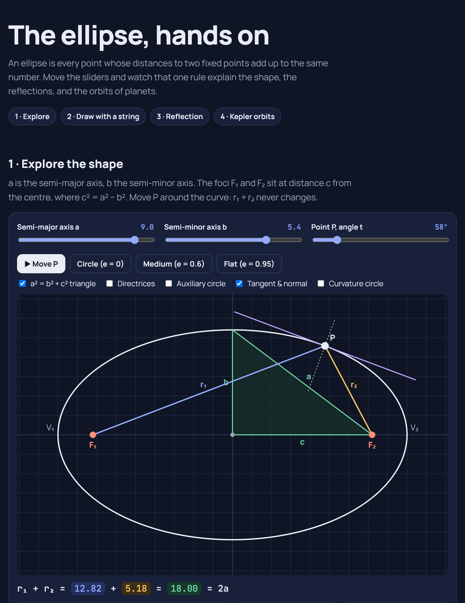

# The Ellipse

<picture>
  <source media="(prefers-color-scheme: dark)" srcset="images/ellipse-anatomy-dark.png">
  
</picture>

**[▶ Live demo: Ellipse Lab](https://yanshuman.github.io/cryptography/elliptic-curves/ellipse/)** · [Elliptic curves section](../README.md) · [All projects](../../README.md)

The ellipse is the first stop in the **Elliptic Curves** section. Elliptic-curve cryptography does not use ellipses directly, but the name "elliptic curve" comes from the ellipse (see [section 11](#11-ellipse-vs-elliptic-curve-the-link-to-cryptography)). This guide explains what an ellipse is, where its equations come from, and where it shows up in the real world. It ends with an interactive project you can run and extend.

## Contents

1. [What is an ellipse?](#1-what-is-an-ellipse)
2. [Parts of an ellipse](#2-parts-of-an-ellipse)
3. [Equations](#3-equations)
4. [Eccentricity](#4-eccentricity)
5. [The focus–directrix definition](#5-the-focusdirectrix-definition)
6. [Area](#6-area)
7. [Perimeter: the hard part](#7-perimeter-the-hard-part)
8. [Tangents, curvature and the reflection property](#8-tangents-curvature-and-the-reflection-property)
9. [How to draw an ellipse](#9-how-to-draw-an-ellipse)
10. [History](#10-history)
11. [Ellipse vs elliptic curve: the link to cryptography](#11-ellipse-vs-elliptic-curve-the-link-to-cryptography)
12. [Where ellipses are used](#12-where-ellipses-are-used)
13. [Project: Ellipse Lab](#13-project-ellipse-lab)
14. [More project ideas](#14-more-project-ideas)
15. [Questions & Answers](#15-questions--answers)
16. [References](#16-references)

---

## 1. What is an ellipse?

**In plain words:** push two pins into a board, loop a piece of string around them, pull it tight with a pencil and go all the way round. The shape you draw is an ellipse.

**Formally:** an ellipse is the set of all points P in a plane whose distances to two fixed points F₁ and F₂ (the **foci**) add up to the same constant:

$$
r_1 + r_2 = |PF_1| + |PF_2| = 2a
$$

The string in the pin-and-string picture has length 2a. It can stretch to any position, but its total length never changes, so the pencil can only move along the ellipse.

Other ways to see the same shape:

- **A conic section.** Slice a cone with a plane that is tilted, but less steeply than the cone's side. A horizontal cut gives a circle; tilt it further and you get a parabola, then a hyperbola.
- **A squashed circle.** Take a circle and scale it in one direction only. Every ellipse is a stretched or squashed circle.
- **A shadow.** The shadow of a ball on a tilted wall, or a circular glass rim seen at an angle, is an ellipse.

## 2. Parts of an ellipse

Using the picture above (a = 5, b = 3):

| Part | Symbol | Meaning | Example |
|---|---|---|---|
| Centre | C | Midpoint between the foci | (0, 0) |
| Foci | F₁, F₂ | The two fixed points | (−4, 0), (4, 0) |
| Vertices | V₁, V₂ | Ends of the long axis | (±5, 0) |
| Co-vertices | B₁, B₂ | Ends of the short axis | (0, ±3) |
| Semi-major axis | a | Half the longest width | 5 |
| Semi-minor axis | b | Half the shortest width | 3 |
| Focal distance | c | Centre to each focus, c² = a² − b² | 4 |
| Eccentricity | e | How flat it is, e = c / a | 0.8 |
| Semi-latus rectum | ℓ | Half the chord through a focus, perpendicular to the major axis: ℓ = b² / a | 1.8 |
| Directrices | — | Two lines at x = ±a / e | x = ±6.25 |

**Why c² = a² − b²:** put P at the co-vertex B₁ = (0, b). It is the same distance from both foci, so each distance is half of 2a, which is a. The green right triangle in the picture has hypotenuse a, base c and height b, so a² = b² + c² by Pythagoras.

## 3. Equations

### From the definition to the standard equation

Put the foci at (−c, 0) and (c, 0). A point (x, y) is on the ellipse when:

$$
\sqrt{(x+c)^2 + y^2} + \sqrt{(x-c)^2 + y^2} = 2a
$$

Move one root to the right-hand side and square both sides:

$$
(x+c)^2 + y^2 = 4a^2 - 4a\sqrt{(x-c)^2 + y^2} + (x-c)^2 + y^2
$$

Most terms cancel, which leaves:

$$
a\sqrt{(x-c)^2 + y^2} = a^2 - cx
$$

Square again, then expand:

$$
a^2(x^2 - 2cx + c^2 + y^2) = a^4 - 2a^2cx + c^2x^2
$$

$$
(a^2 - c^2)\,x^2 + a^2y^2 = a^2(a^2 - c^2)
$$

Replace a² − c² with b² and divide by a²b². This gives the **standard form**:

$$
\boxed{\;\frac{x^2}{a^2} + \frac{y^2}{b^2} = 1\;}
$$

### Other forms

| Form | Equation | When to use it |
|---|---|---|
| Standard (centre at origin) | x²/a² + y²/b² = 1 | Most problems |
| Shifted centre (x₀, y₀) | (x − x₀)²/a² + (y − y₀)²/b² = 1 | Ellipse not at the origin |
| Parametric | x = a cos t, y = b sin t, 0 ≤ t < 2π | Drawing, animation, arc length |
| Polar, measured from a focus | r = a(1 − e²) / (1 + e cos θ) | Orbits (θ from perihelion) |
| Focal radii | r₁ = a + e·x, r₂ = a − e·x | Distances from P to each focus |

**Example:** the point (3, 2.4) lies on x²/25 + y²/9 = 1, because 9/25 + 5.76/9 = 0.36 + 0.64 = 1. Its focal radii are r₁ = 5 + 0.8·3 = 7.4 and r₂ = 5 − 0.8·3 = 2.6, which add up to 10 = 2a ✓.

The parameter t in the parametric form is **not** the angle of P seen from the centre. It is the angle of the matching point Q on the **auxiliary circle** of radius a (try the "Auxiliary circle" toggle in the lab). In astronomy t is called the **eccentric anomaly**.

### The general second-degree equation

Any curve of the form

$$
Ax^2 + Bxy + Cy^2 + Dx + Ey + F = 0
$$

is a conic. It is an ellipse (or a circle, a single point, or nothing at all) when

$$
B^2 - 4AC < 0
$$

If B ≠ 0, the ellipse is rotated, and its major axis makes an angle θ with the x-axis where tan 2θ = B / (A − C). If B² − 4AC = 0 the curve is a parabola, and if it is > 0 the curve is a hyperbola.

Five points in general position fix a unique conic. If you already know the axes are parallel to the x- and y-axes (B = 0), four points are enough.

## 4. Eccentricity

Eccentricity e = c / a measures how far the foci are from the centre, as a fraction of a. Equivalently, e = √(1 − b²/a²).

| e | Shape | Real example |
|---|---|---|
| 0 | Circle (foci meet at the centre) | — |
| 0.0167 | Almost a circle | Earth's orbit |
| 0.0934 | Slightly oval | Mars's orbit |
| 0.2056 | Noticeably oval | Mercury's orbit |
| 0.2488 | Oval | Pluto's orbit |
| 0.967 | Very long and thin | Halley's comet |
| → 1 | Approaches a parabola | — |

Earth's orbit is so close to a circle that you couldn't tell by eye. Even so, Earth is about 3.3% closer to the Sun in early January than in early July. (The seasons come from Earth's axial tilt, not from this distance.)

## 5. The focus–directrix definition

An ellipse can also be defined using **one** focus and a straight line called the **directrix**:

> P is on the ellipse when (distance from P to the focus) ÷ (distance from P to the directrix) = e, where 0 < e < 1.

For the ellipse x²/a² + y²/b² = 1, the directrix that goes with F₂ = (c, 0) is the line x = a/e. Changing the ratio e gives the whole conic family: e < 1 gives an ellipse, e = 1 a parabola, and e > 1 a hyperbola. This one rule ties all the conic sections together.

## 6. Area

$$
A = \pi a b
$$

**Why:** the ellipse is a circle of radius a, squashed vertically by the factor b/a. Squashing multiplies every area by the same factor, so

$$
A = \pi a^2 \cdot \frac{b}{a} = \pi a b
$$

For a = 5 and b = 3, A = 15π ≈ 47.12. When a = b = r this becomes πr², the area of a circle. (Integrating y = (b/a)√(a² − x²) from −a to a gives the same answer.)

## 7. Perimeter: the hard part

Surprisingly, the perimeter of an ellipse has **no formula** made from ordinary functions. The exact value is an integral:

$$
P = \int_0^{2\pi} \sqrt{a^2\sin^2 t + b^2\cos^2 t}\;dt \;=\; 4a\,E(e)
$$

Here E(e) is the **complete elliptic integral of the second kind**. Integrals like this are called *elliptic integrals*, and they are where the word "elliptic" in *elliptic curve* comes from (section 11).

Ways to compute it in practice:

| Method | Formula | a = 5, b = 3 |
|---|---|---|
| Exact (numerical integration) | 4a·E(e) | **25.526999** |
| Ramanujan II (1914) | π(a + b)[1 + 3h / (10 + √(4 − 3h))] | 25.526999 (error ≈ 6 × 10⁻¹⁰) |
| Ramanujan I | π[3(a + b) − √((3a + b)(a + 3b))] | 25.526986 |
| Naive guess | 2π√((a² + b²)/2) | 25.906 (1.5% too big) |

where h = (a − b)² / (a + b)². For this ellipse h = 0.0625.

The **Gauss–Kummer series** converges quickly when the ellipse isn't too flat:

$$
P = \pi(a+b)\left(1 + \frac{h}{4} + \frac{h^2}{64} + \frac{h^3}{256} + \frac{25h^4}{16384} + \dots\right)
$$

Ramanujan's second formula is so accurate that its relative error grows only like h⁵. It's the one used in the Ellipse Lab, which also shows the error against the exact value.

## 8. Tangents, curvature and the reflection property

**Tangent at a point.** The tangent line to x²/a² + y²/b² = 1 at the point (x₁, y₁) is

$$
\frac{x\,x_1}{a^2} + \frac{y\,y_1}{b^2} = 1
$$

**Curvature.** At parameter t the curvature is

$$
\kappa(t) = \frac{ab}{\left(a^2\sin^2 t + b^2\cos^2 t\right)^{3/2}}
$$

The ellipse bends most sharply at the vertices, where the radius of curvature is b²/a. It is flattest at the co-vertices, where the radius is a²/b.

**The reflection property.** The tangent at any point P makes equal angles with the two focal lines PF₁ and PF₂. So **a ray leaving one focus reflects off the ellipse straight through the other focus**, and every ray from that focus takes the same total path length, 2a. Sound or light sent out from one focus therefore arrives at the other focus all at the same moment. This is the idea behind whispering galleries and lithotripsy (section 12).

Rays that don't pass through a focus behave differently. If a ray never crosses the segment between the foci, all its reflections stay tangent to a smaller ellipse with the same foci. If it does cross that segment, its reflections stay tangent to a hyperbola with the same foci. You can test this in section 3 of the lab by dragging the source off the focus.

## 9. How to draw an ellipse

| Method | How it works |
|---|---|
| **Pins and string (gardener's method)** | Two pins at the foci, a loop of string of length 2a + 2c, and a pencil keeping the string tight. Gardeners use it to lay out oval flower beds. |
| **Trammel** | Mark two points on a straight stick, a distance a − b apart. Slide the stick so one mark stays on the x-axis and the other on the y-axis. The stick's end traces an ellipse. The "ellipsograph" toy works this way. |
| **Squashed circle** | Draw a circle of radius a and shrink every y-coordinate by b/a. |
| **Two concentric circles** | Draw circles of radius a and b. For each angle t, take x from the big circle and y from the small one: (a cos t, b sin t). |
| **Computer graphics** | The **midpoint ellipse algorithm** draws ellipses pixel by pixel using only integer additions. Screens and plotters have used it for decades. |

An ellipse spun around its major axis gives a **prolate spheroid** (rugby ball). Spun around its minor axis, it gives an **oblate spheroid** (a squashed ball, like the Earth).

## 10. History

| When | Who | What |
|---|---|---|
| ~350 BC | Menaechmus | First studied conic sections, while trying to double the cube |
| ~300 BC | Euclid | Wrote about conics (his book on them is lost) |
| ~200 BC | Apollonius of Perga | Wrote *Conics* and gave the names *ellipse*, *parabola* and *hyperbola*. "Ellipse" comes from Greek *élleipsis*, meaning "falling short". |
| ~300 AD | Pappus of Alexandria | Described the focus and directrix property |
| 1609 | Johannes Kepler | Published that Mars moves on an ellipse with the Sun at one focus. He introduced the word *focus* (Latin for "hearth, fireplace"). |
| 1687 | Isaac Newton | Proved that the inverse-square law of gravity produces elliptical orbits |
| 1705 | Edmond Halley | Showed that the comet now named after him moves on a long ellipse, and predicted its return |
| 1700s | Fagnano, Euler | Studied *elliptic integrals*, which came from the arc length of an ellipse |
| 1820s | Abel, Jacobi | Inverted elliptic integrals to get *elliptic functions* |
| 1914 | Srinivasa Ramanujan | Published his famous perimeter approximations |
| 1985 | Koblitz, Miller | Independently proposed elliptic-curve cryptography |

## 11. Ellipse vs elliptic curve: the link to cryptography

This is the most common mix-up in this subject:

> **An elliptic curve is not an ellipse.**

| | Ellipse | Elliptic curve |
|---|---|---|
| Equation | x²/a² + y²/b² = 1 (degree 2) | y² = x³ + ax + b (degree 3) |
| Shape | A closed oval | One or two pieces, one of which runs off to infinity |
| Points form a group? | No | **Yes**: you can "add" points |
| Used in cryptography? | No | **Yes**: ECC, used in Bitcoin, HTTPS, Signal, SSH |

**Why do they share a name?** It goes back through four steps:

1. Measuring the **perimeter of an ellipse** leads to an integral with no closed form (section 7). Integrals of this kind became known as **elliptic integrals**.
2. In the 1820s Abel and Jacobi turned these integrals "inside out" and got **elliptic functions**. These are periodic in two directions, like a pattern on a grid.
3. Weierstrass showed that elliptic functions satisfy an equation of the form y² = 4x³ − g₂x − g₃, which is a cubic curve.
4. These cubic curves were then called **elliptic curves**: the curves that elliptic functions live on.

So the ellipse is the grandparent of the elliptic curve. In cryptography, points on an elliptic curve are added using a chord-and-tangent rule. Repeating that addition is fast, but undoing it (the *elliptic-curve discrete logarithm problem*) is believed to be extremely hard. That plays the same role as factoring does for [RSA](../../rsa/README.md), but with much smaller keys: a 256-bit ECC key gives about the same security as a 3072-bit RSA key.

## 12. Where ellipses are used

| Field | Use | Which property |
|---|---|---|
| **Astronomy & space** | Planets, moons, comets and satellites all move on ellipses. Molniya communication satellites use very long ellipses (e ≈ 0.74) to hang over high latitudes for hours. | Kepler's laws |
| **Medicine** | **Lithotripsy:** a shock wave fired at one focus of an ellipsoidal reflector concentrates at the other focus, where the kidney stone sits, breaking it without surgery. | Reflection property |
| **Architecture & acoustics** | **Whispering galleries**, such as Statuary Hall in the US Capitol: a whisper at one focus is heard clearly at the other. Elliptical domes and arches. | Reflection property |
| **Optics & lighting** | Ellipsoidal reflector spotlights in theatres, dental lamps, and furnaces that focus heat onto a sample. | Reflection property |
| **Geodesy & GPS** | Earth is modelled as an oblate spheroid (the WGS 84 ellipsoid: a = 6 378 137 m, flattening 1/298.257). Every GPS coordinate is measured on it. | Rotated ellipse |
| **Statistics & data science** | **Confidence ellipses** and **error ellipses** show the spread of 2-D data. GPS accuracy and the covariance of two variables are drawn as ellipses. | Quadratic form xᵀΣ⁻¹x = k |
| **Engineering** | **Elliptical gears** give varying speed from a constant motor. Elliptical tank cross-sections. The Spitfire's elliptical wing, which minimises induced drag. | Shape and curvature |
| **Computer vision** | Fitting ellipses to detect pupils (eye tracking), cells, coins, wheels, and circles seen in perspective. | Circles in perspective look like ellipses |
| **Computer graphics** | The midpoint ellipse algorithm, SVG `<ellipse>`, CSS `border-radius`, and game hitboxes. | Parametric and implicit forms |
| **Mechanical engineering** | Planetary gear analysis, cam profiles, and the trammel (ellipsograph) mechanism. | Trammel construction |

## 13. Project: Ellipse Lab



[`index.html`](index.html) is a single-page app with four interactive sections:

1. **Explore the shape:** sliders for a, b and the point P. It shows live r₁ + r₂ = 2a, the a² = b² + c² triangle, directrices, the auxiliary circle, the tangent and normal, and the curvature circle. Stat cards give c, e, area, exact perimeter, Ramanujan's approximation and its error, the semi-latus rectum, and the directrices.
2. **Draw it with a string:** animates the gardener's method, with the string length shown as always equal to 2a.
3. **Reflection property:** fires rays from a focus and shows them all bouncing through the other focus. Drag the source off the focus to see the focusing break.
4. **Kepler orbits:** a planet moving on its ellipse at the correct speed (solving Kepler's equation M = E − e sin E), with equal-time slices that show the 2nd law. There are presets for Earth, Mars, Mercury, Pluto and Halley's comet.

**How to run:** no installation needed. Double-click `index.html`, or run `start index.html` in this folder, or use the [live demo](https://yanshuman.github.io/cryptography/elliptic-curves/ellipse/).

## 14. More project ideas

Ideas to build next, from easiest to hardest:

| Level | Project | What you'll learn |
|---|---|---|
| ⭐ | **Ellipse calculator.** Enter any two of a, b, c, e and get every other property. | The relations c² = a² − b² and e = c/a |
| ⭐ | **Midpoint ellipse algorithm visualiser.** Draw an ellipse on a pixel grid one pixel at a time. | Computer-graphics rasterisation |
| ⭐⭐ | **Solar system simulator.** Real planets placed by their orbital elements (a, e, inclination) on any date. | Kepler's equation, orbital mechanics |
| ⭐⭐ | **Elliptical billiards.** A ball bouncing inside an elliptical table, showing the caustics it traces. | Reflection, dynamical systems |
| ⭐⭐ | **Error-ellipse plotter.** Paste 2-D data and draw its 1σ, 2σ and 3σ confidence ellipses. | Covariance, eigenvectors, statistics |
| ⭐⭐⭐ | **Ellipse fitting from points.** Click 5 or more points and fit the best ellipse with the Fitzgibbon least-squares method. Then try it on a webcam image for pupil detection. | Linear algebra, computer vision |
| ⭐⭐⭐ | **Elliptical gear generator.** Design a matched pair of gears and export SVG for laser cutting. | Gear geometry, CAD |
| ⭐⭐⭐ | **Elliptic curve explorer:** the next project in this section. Plot y² = x³ + ax + b, add points with chord and tangent, then switch to a finite field and do an ECC key exchange. | The cryptography this section is building towards |

## 15. Questions & Answers

<details>
<summary><b>Is a circle an ellipse?</b></summary>

Yes. A circle is the special case a = b, so c = 0 and e = 0, and both foci sit at the centre. Every formula in this guide still works: for example, the area πab becomes πr².
</details>

<details>
<summary><b>What's the difference between an ellipse and an oval?</b></summary>

"Oval" is an informal word for any egg-like rounded shape. An ellipse is one exact oval, defined by r₁ + r₂ = 2a. An egg shape is an oval but not an ellipse, because it isn't symmetric end to end.
</details>

<details>
<summary><b>Why is there no simple formula for the perimeter?</b></summary>

The arc-length integral √(a² sin² t + b² cos² t) can't be written in terms of polynomials, roots, logs or trig functions. It is a genuinely new function, the elliptic integral. That's why we use series or approximations such as Ramanujan's, which are accurate enough for any practical purpose.
</details>

<details>
<summary><b>Do planets really move on ellipses?</b></summary>

Very nearly. Two bodies attracting by gravity alone move on exact ellipses (Newton's proof of Kepler's 1st law). Real orbits also get small nudges from other planets and from relativity. For example, Mercury's ellipse slowly rotates, which was one of the first confirmations of Einstein's general relativity.
</details>

<details>
<summary><b>Why does a planet move faster when it's close to the Sun?</b></summary>

Angular momentum is conserved, so the line from the Sun sweeps equal areas in equal times (Kepler's 2nd law). Close to the Sun that line is short, so the planet must move faster to sweep the same area. The ratio of fastest to slowest speed is (1 + e)/(1 − e). That's 1.03 for Earth and about 60 for Halley's comet.
</details>

<details>
<summary><b>What does the eccentricity actually tell me?</b></summary>

How far each focus is from the centre, as a fraction of the semi-major axis (e = c/a). At e = 0 the foci meet at the centre (a circle). As e gets close to 1, the foci move out towards the ends of the ellipse and it becomes long and thin.
</details>

<details>
<summary><b>Why does a tilted circle look like an ellipse?</b></summary>

Tilting a circle by an angle θ shrinks it in one direction by cos θ and leaves the other direction unchanged. That's exactly the "squashed circle" construction, with b = a cos θ. It's why wheels, plates and the rims of cups look elliptical in photos, and why computer vision fits ellipses to find them.
</details>

<details>
<summary><b>How do whispering galleries work?</b></summary>

A sound made at one focus spreads out, hits the curved wall, and every part of it reflects towards the other focus. Every path is the same length (2a), so all the reflections arrive together and add up. That makes a whisper loud and clear across the room, while people in between hear very little.
</details>

<details>
<summary><b>Is an elliptic curve just a fancy ellipse?</b></summary>

No. An ellipse is a degree-2 closed curve. An elliptic curve is a degree-3 curve, y² = x³ + ax + b, with a special "addition" of points that makes it useful for cryptography. They share a name only through history: elliptic integrals → elliptic functions → elliptic curves. See section 11.
</details>

<details>
<summary><b>How do I find the ellipse through a set of points?</b></summary>

An ellipse with axes parallel to the coordinate axes has four unknowns, so four points determine it. A general, rotated ellipse needs five. With more points than that, which is usual with real measurements, you find the best fit by least squares. The Fitzgibbon "direct least squares" method always returns an ellipse rather than a hyperbola. It's a great project (section 14).
</details>

<details>
<summary><b>What is the latus rectum used for?</b></summary>

The semi-latus rectum ℓ = b²/a appears in the orbit equation r = ℓ / (1 + e cos θ). It's the distance from the focus to the curve, measured at right angles to the major axis. It's convenient because it works the same for ellipses, parabolas and hyperbolas.
</details>

## 16. References

- Weisstein, E. W. "Ellipse." *MathWorld: A Wolfram Resource.* https://mathworld.wolfram.com/Ellipse.html
- Hilbert, D. and Cohn-Vossen, S. *Geometry and the Imagination.* New York: Chelsea, pp. 2–3, 1999.
- Lockwood, E. H. "The Ellipse." Ch. 2 in *A Book of Curves.* Cambridge University Press, 1967.
- Eves, H. *A Survey of Geometry,* rev. ed. Boston: Allyn & Bacon, 1965.
- Coxeter, H. S. M. "Conics." §8.4 in *Introduction to Geometry,* 2nd ed. Wiley, 1969.
- Ramanujan, S. "Modular Equations and Approximations to π." *Quart. J. Pure Appl. Math.* 45, 350–372, 1914.
- Abbott, P. "On the Perimeter of an Ellipse." *Mathematica Journal* 11, 172–185, 2009.
- MacTutor History of Mathematics Archive. "Ellipse." https://mathshistory.st-andrews.ac.uk/Curves/Ellipse/
- Koblitz, N. "Elliptic Curve Cryptosystems." *Mathematics of Computation* 48, 203–209, 1987.
- Miller, V. "Use of Elliptic Curves in Cryptography." *CRYPTO '85,* LNCS 218, 417–426, 1986.

---

### Files

```
ellipse/
├── README.md                     # This guide
├── index.html                    # Ellipse Lab (explorer, string, reflection, Kepler orbits)
└── images/
    ├── ellipse-anatomy.svg       # Labelled diagram (vector)
    ├── ellipse-anatomy-light.png # Labelled diagram (light theme)
    ├── ellipse-anatomy-dark.png  # Labelled diagram (dark theme)
    └── ellipse-lab.png           # Screenshot of the Ellipse Lab
```
