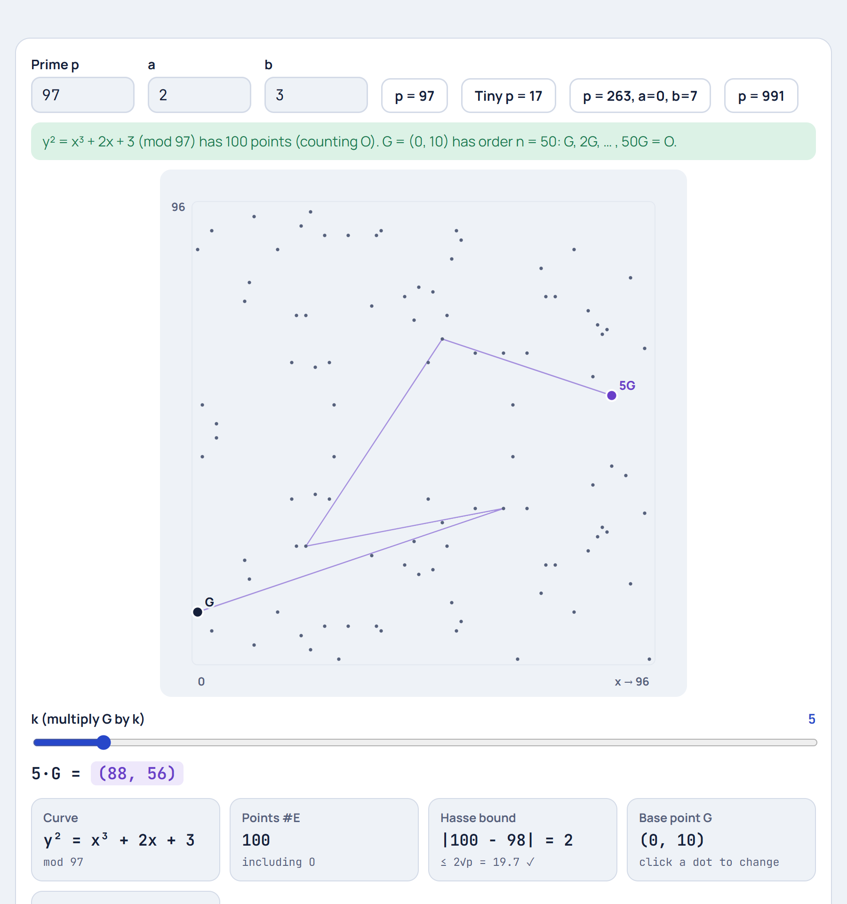

# Elliptic Curves


**[▶ Live demo: Elliptic Curve Lab](https://yanshuman.github.io/cryptography/elliptic-curves/elliptic-curve/)** · **[📘 Beginner walkthrough, step by step](step-by-step.md)** · **[🌐 Real-life example: opening a website](real-life-example.md)** · [Previous: the Ellipse](../ellipse/README.md) · [Elliptic curves section](../README.md)

Elliptic-curve cryptography (ECC) secures HTTPS, Bitcoin, Signal, WhatsApp and SSH. This guide explains what an elliptic curve is, how its points are added together, how that becomes a one-way function, and why it's used almost everywhere today. The **Elliptic Curve Lab** lets you try every step with your own numbers.

> **New to this?** Start with [**Elliptic Curve Cryptography, Step by Step**](step-by-step.md). It works through one tiny curve, y² = x³ + 2x + 2 (mod 17), entirely by hand: adding points, making keys, and a full key exchange.
> Then read [**ECC in Real Life**](real-life-example.md) to see the same numbers used when your browser opens an HTTPS website, and how WhatsApp and Bitcoin differ.

## Contents

1. [What is an elliptic curve?](#1-what-is-an-elliptic-curve)
2. [How it works: adding points](#2-how-it-works-adding-points)
3. [From smooth curves to a finite field](#3-from-smooth-curves-to-a-finite-field)
4. [Multiplying a point: double-and-add](#4-multiplying-a-point-double-and-add)
5. [The one-way function: ECDLP](#5-the-one-way-function-ecdlp)
6. [Key exchange (ECDH)](#6-key-exchange-ecdh)
7. [Digital signatures (ECDSA)](#7-digital-signatures-ecdsa)
8. [Why we use elliptic curves](#8-why-we-use-elliptic-curves)
9. [Real-world curves](#9-real-world-curves)
10. [Where elliptic curves are used](#10-where-elliptic-curves-are-used)
11. [Attacks and pitfalls](#11-attacks-and-pitfalls)
12. [Project: Elliptic Curve Lab](#12-project-elliptic-curve-lab)
13. [Questions & Answers](#13-questions--answers)
14. [References](#14-references)

---

## 1. What is an elliptic curve?

An elliptic curve is the set of points (x, y) that satisfy

$$
y^2 = x^3 + ax + b
$$

plus one extra point called **O**, the *point at infinity* (explained below). The numbers a and b choose which curve you get. This is the *short Weierstrass form*, and it's the one most cryptography uses.

**One rule:** the curve must be **smooth**, with no sharp corners and no self-crossings. That holds exactly when

$$
4a^3 + 27b^2 \neq 0
$$

If 4a³ + 27b² = 0, the curve has a cusp or a node, point addition breaks there, and it isn't an elliptic curve. Try **Broken (a = 0, b = 0)** in the lab to see the cusp.

**Shapes over the real numbers:**

| 4a³ + 27b² | Shape | Example |
|---|---|---|
| > 0 | One connected piece | y² = x³ − x + 1, y² = x³ + 7 (Bitcoin's curve) |
| < 0 | Two pieces: a closed oval plus an open branch | y² = x³ − 3x + 1 |
| = 0 | Singular (not allowed) | y² = x³ |

The curve is always symmetric about the x-axis, because if (x, y) is on it, so is (x, −y).

> **It's not an ellipse.** An ellipse is a degree-2 closed curve. An elliptic curve is degree 3 and runs off to infinity. The name comes from *elliptic integrals*, which first appeared when measuring the perimeter of an ellipse. The full story is in the [Ellipse guide](../ellipse/README.md#11-ellipse-vs-elliptic-curve-the-link-to-cryptography).

## 2. How it works: adding points

The surprising fact behind ECC is that points on the curve can be **added**, and the result is always another point on the curve.

### The chord-and-tangent rule

**To add two different points P and Q:**

1. Draw the straight line through P and Q.
2. Because the curve is a cubic, the line meets it at **exactly one more point**. Call it −R.
3. Flip that point over the x-axis. The flipped point is **R = P + Q**.

**To double a point (P + P = 2P):** use the **tangent** line at P instead of a line through two points, then do steps 2 and 3 in the same way.

**Special cases:**

- **P + (−P) = O.** The line through a point and its mirror image is vertical, so it never meets the curve a third time. We say it meets it "at infinity", at O.
- **P + O = P.** O behaves like zero.
- **The tangent at a point with y = 0 is vertical,** so 2P = O.

### The formulas

For P = (x₁, y₁) and Q = (x₂, y₂):

| | Slope λ |
|---|---|
| P ≠ Q | λ = (y₂ − y₁) / (x₂ − x₁) |
| P = Q (doubling) | λ = (3x₁² + a) / (2y₁) |

Then

$$
x_3 = \lambda^2 - x_1 - x_2, \qquad y_3 = \lambda\,(x_1 - x_3) - y_1
$$

and P + Q = (x₃, y₃).

**Example from the lab:** on y² = x³ − x + 1, take P = (−1, 1) and Q = (0.3, −0.85). Then λ = −1.43, x₃ = 2.73 and y₃ = 4.32, so P + Q = (2.73, 4.32). Check: 4.32² ≈ 18.7 ≈ 2.73³ − 2.73 + 1 ✓.

### It's a group

This addition behaves like ordinary addition. That makes the points a **group**, which is exactly what cryptography needs:

| Property | Meaning |
|---|---|
| Closure | P + Q is always on the curve |
| Identity | P + O = P |
| Inverse | Every P has −P, with P + (−P) = O |
| Commutative | P + Q = Q + P (the line through P and Q is the same line) |
| Associative | (P + Q) + R = P + (Q + R). This is true, but surprisingly hard to prove. |

## 3. From smooth curves to a finite field

Computers can't store real numbers exactly, and smooth curves leak information through their geometry. So cryptography does all the arithmetic **modulo a prime p**, using only the whole numbers 0, 1, …, p − 1:

$$
y^2 \equiv x^3 + ax + b \pmod{p}
$$



- The curve becomes a **scatter of dots** with no visible shape (see above).
- The **same formulas** still work. "Dividing" means multiplying by a modular inverse, found with the Extended Euclidean Algorithm, and that is why p must be prime.
- The dots are still symmetric, now about the line y = p/2, because −y ≡ p − y.

**How many points?** Hasse's theorem says the number of points #E (including O) is always close to p + 1:

$$
|\#E - (p + 1)| \le 2\sqrt{p}
$$

For y² = x³ + 2x + 3 mod 97 there are **100 points**, and |100 − 98| = 2 ≤ 19.7 ✓.

**Order of a point:** if you keep adding a point G to itself, G, 2G, 3G, …, you eventually reach O. The number of steps it takes is the **order n** of G, and n always divides #E. In the lab's default example, G = (0, 10) has order n = 50.

## 4. Multiplying a point: double-and-add

**Scalar multiplication** k·G means G + G + … + G (k times). For a 256-bit k you can't add one at a time: that would take about 10⁷⁷ steps. Instead, write k in binary and use **double-and-add**:

1. Start with a running total R = O and the current point A = G.
2. For each bit of k, from the lowest: if the bit is 1, set R = R + A. Then double A, so A = 2A.

**Example:** k = 13 = 1101₂ gives 13G = G + 4G + 8G. That takes 3 doublings and 2 additions instead of 12 additions. A 256-bit k needs only about 256 doublings and about 128 additions.

Real implementations use a **constant-time** version (such as the Montgomery ladder) that does the same work for every bit, so the timing doesn't leak the bits of k.

## 5. The one-way function: ECDLP

Given G and k, computing **Q = k·G is fast** (double-and-add).
Given G and Q, finding **k is believed to be infeasible**.

This is the **Elliptic-Curve Discrete Logarithm Problem (ECDLP)**, and it's the foundation of ECC:

| Direction | Work for a 256-bit curve |
|---|---|
| k → k·G | About 256 doublings, which takes microseconds |
| k·G → k (best known attack, Pollard's rho) | About 2¹²⁸ ≈ 3.4 × 10³⁸ point additions |

At a billion billion (10¹⁸) additions per second, 2¹²⁸ additions would take about 10¹³ years, nearly 800 times the age of the universe. As section 2 of the lab shows, the multiples of G jump around with no pattern, so there's no shortcut from looking at where k·G lands.

## 6. Key exchange (ECDH)

**Elliptic-Curve Diffie–Hellman** lets two people who have never met agree on a shared secret over a public channel.

| Step | Alice | Public channel | Bob |
|---|---|---|---|
| 1. Agree | Curve, G, n | everyone sees these | Curve, G, n |
| 2. Pick a secret | α (random, 1 ≤ α < n) | — | β (random) |
| 3. Send | A = α·G | A and B are sent | B = β·G |
| 4. Compute | α·B | — | β·A |

Both get the same point, because

$$
\alpha \cdot B = \alpha\beta \cdot G = \beta \cdot A
$$

**Lab example** (y² = x³ + 2x + 3 mod 97, G = (0, 10)): α = 13 and β = 29 give A = (87, 70) and B = (47, 18). Both sides compute the shared secret (49, 63) ✓.

In practice the shared point's x-coordinate is passed through a key-derivation function (such as HKDF) to make an AES key. HTTPS (TLS 1.3), Signal and SSH all use ECDH, usually with **X25519**.

⚠️ ECDH alone doesn't prove *who* you're talking to. An attacker in the middle could run two separate exchanges, one with each side. That's why it's always combined with signatures or certificates.

## 7. Digital signatures (ECDSA)

ECC also signs messages. With a private key d and public key Q = d·G:

**Signing** a message with hash h:
1. Pick a fresh random nonce k, and compute R = k·G.
2. Set r = R.x mod n.
3. Set s = k⁻¹ (h + r·d) mod n.
4. The signature is (r, s).

**Verifying** with the public key Q:
1. Compute u₁ = h·s⁻¹ mod n and u₂ = r·s⁻¹ mod n.
2. Compute R′ = u₁·G + u₂·Q.
3. The signature is valid if R′.x mod n = r.

**Ed25519** (EdDSA) is a newer signature scheme on Curve25519. It's faster, and it derives the nonce from the message itself, so the nonce can never be accidentally reused (see section 11).

## 8. Why we use elliptic curves

| Benefit | Why it matters |
|---|---|
| **Small keys** | A 256-bit ECC key gives about 128-bit security. Keys and signatures are tiny: an Ed25519 public key is 32 bytes and a signature is 64 bytes. |
| **Fast** | Key generation, key exchange and signing take microseconds, even on phones. |
| **Low power & bandwidth** | Ideal for smart cards, IoT sensors, car keys and passports, which have tiny chips and little energy. |
| **Smaller certificates** | Faster HTTPS handshakes and less data sent over the network. |
| **Mature and standardised** | Built into TLS 1.3, SSH, Signal, FIDO2/passkeys, Bitcoin, and every major OS and browser. |
| **No known shortcut** | After 40 years of research, the best general attack on ECDLP is still square-root time (Pollard's rho). |

**Security level vs key size:**

| Security level | ECC key size | Example curve |
|---|---|---|
| 128-bit | 256 bits | P-256, secp256k1, Curve25519 |
| 192-bit | 384 bits | P-384 |
| ~224-bit | 448 bits | Curve448 |
| 256-bit | 521 bits | P-521 |

## 9. Real-world curves

| Curve | Equation / form | Prime p | Used by |
|---|---|---|---|
| **secp256k1** | y² = x³ + 7 | 2²⁵⁶ − 2³² − 977 | Bitcoin, Ethereum and most blockchains |
| **P-256** (secp256r1) | y² = x³ − 3x + b | 2²⁵⁶ − 2²²⁴ + 2¹⁹² + 2⁹⁶ − 1 | HTTPS certificates, Apple Secure Enclave, FIDO2 security keys, government systems |
| **Curve25519** | y² = x³ + 486662x² + x (Montgomery form) | 2²⁵⁵ − 19 | X25519 key exchange: TLS 1.3, Signal, WhatsApp, SSH, WireGuard |
| **Ed25519** | Twisted Edwards form of Curve25519 | 2²⁵⁵ − 19 | SSH keys, Git commit signing, Tor, package signing |
| **P-384 / P-521** | y² = x³ − 3x + b | 384 / 521-bit | High-security government use |

The lab's **"Bitcoin shape (a = 0, b = 7)"** preset draws secp256k1's equation over the real numbers. The **p = 263, a = 0, b = 7** preset is the same equation over a tiny field.

## 10. Where elliptic curves are used

| Where | What ECC does |
|---|---|
| **HTTPS / TLS 1.3** | X25519 or P-256 key exchange for every connection, and ECDSA certificates |
| **Messaging** | Signal, WhatsApp and iMessage set up end-to-end encryption with X25519 |
| **Cryptocurrency** | Your wallet's private key is a number d, and your address comes from d·G on secp256k1. Every transaction is signed with ECDSA or Schnorr. |
| **SSH** | `ssh-keygen -t ed25519` is the recommended key type |
| **Passkeys / FIDO2** | Phone and security-key logins use P-256 signatures |
| **VPNs** | WireGuard is built entirely on Curve25519 |
| **Payments & ID** | Chip bank cards, e-passports, national ID cards |
| **Software updates** | Android, Apple and Linux package managers verify ECC signatures |
| **Cars & IoT** | Keyless entry, smart meters and sensors, where tiny chips need small, fast crypto |

## 11. Attacks and pitfalls

The math is strong, but implementations can be weak:

| Mistake | What goes wrong | Real case |
|---|---|---|
| **Reusing an ECDSA nonce k** | Two signatures with the same k reveal the private key with simple algebra | Sony PlayStation 3 (2010): the same k was used for every signature, so the console's signing key leaked |
| **Weak random numbers** | Predictable k or d can be recovered | Android Bitcoin wallets (2013): a random-number bug led to stolen coins |
| **Invalid-curve attacks** | Not checking that a received point is really on the curve lets an attacker extract key bits | Several TLS and Bluetooth libraries have had this bug |
| **Timing side channels** | Non-constant-time scalar multiplication leaks bits of the key | Attacks on OpenSSL ECDSA (2011, 2019) |
| **Weak curves** | Curves with special structure (anomalous, supersingular, smooth order) have shortcuts | Why curve parameters are chosen so carefully |
| **Suspicious constants** | Dual_EC_DRBG, an elliptic-curve random-number generator, was likely backdoored | NIST withdrew it in 2014. This is why Curve25519 uses simple, explainable constants. |
| **Quantum computers** | Shor's algorithm would solve ECDLP efficiently | No such machine exists yet. Post-quantum standards (ML-KEM, ML-DSA) are being deployed, often in hybrid with X25519. |

**Rule of thumb:** never write your own ECC for real use. Use a well-tested library such as libsodium, OpenSSL, BoringSSL, or Python's `cryptography`.

## 12. Project: Elliptic Curve Lab

[`index.html`](index.html) is a single-page app with four parts:

1. **Add points:** sliders for a and b, and presets for one piece, two pieces, the Bitcoin shape, and a broken (singular) curve. Click the curve to place P and Q, and see the chord, the third point −(P + Q), its reflection P + Q, and every step of the formula with your numbers. Switch to **2P** to see the tangent rule.
2. **Finite field:** enter a prime p (if it isn't prime, the lab suggests nearby primes) and a, b. See every point as a dot, the point count and Hasse's bound. Click any dot to make it G, and slide k to watch k·G hop around.
3. **Key exchange (ECDH):** pick Alice's and Bob's secrets and watch both arrive at the same shared point, with the double-and-add table for A = α·G.
4. **Be the attacker:** Eve tries k = 1, 2, 3, … until k·G = A, steals the secret on the toy curve, and you see why that's impossible on a real 256-bit curve.

**How to run:** no installation needed. Double-click `index.html`, or run `start index.html` in this folder, or use the [live demo](https://yanshuman.github.io/cryptography/elliptic-curves/elliptic-curve/).

**Ideas to extend it:**

- Add an **ECDSA** tab: sign a message on the toy curve, then reuse the nonce and recover the private key.
- Add **point compression**: send only x plus one bit, and recover y with a modular square root.
- Implement **baby-step giant-step** or **Pollard's rho** for the attacker, and compare the number of steps against √n.
- Draw the curve over the real numbers and over 𝔽ₚ side by side, with the same addition highlighted on both.

## 13. Questions & Answers

### Basics

<details>
<summary><b>What is an elliptic curve in one sentence?</b></summary>

A smooth curve y² = x³ + ax + b whose points can be added to each other, so that adding a point to itself many times is easy but undoing it is practically impossible.
</details>

<details>
<summary><b>Is an elliptic curve an ellipse?</b></summary>

No. An ellipse is a closed degree-2 curve (x²/a² + y²/b² = 1). An elliptic curve is a degree-3 curve that runs to infinity. They share a name only through history: ellipse perimeter → elliptic integrals → elliptic functions → elliptic curves. See the [Ellipse guide](../ellipse/README.md).
</details>

<details>
<summary><b>What is the "point at infinity" O?</b></summary>

An extra point added to the curve so that addition always has an answer. When the line through P and Q is vertical (Q = −P), it doesn't meet the curve a third time, so we define P + Q = O. O acts like zero: P + O = P. Picture it as sitting infinitely far up and down, where all vertical lines meet.
</details>

<details>
<summary><b>Why does a line always hit the curve a third time?</b></summary>

Substituting the line y = λx + c into y² = x³ + ax + b gives a cubic equation in x. A cubic with two known roots (x₁ and x₂) must have a third root, and that third root is x₃ = λ² − x₁ − x₂. That's where the formula comes from.
</details>

<details>
<summary><b>Why must 4a³ + 27b² ≠ 0?</b></summary>

When it equals 0, the cubic x³ + ax + b has a repeated root, and the curve gets a cusp or crosses itself. At that point there's no single tangent line, so doubling breaks. Such curves are also cryptographically weak, because their discrete-log problem reduces to an easy one.
</details>

### How it works

<details>
<summary><b>Why use a finite field instead of real numbers?</b></summary>

Three reasons. Computers can only store whole numbers exactly. Real curves have visible geometry, so you could estimate k from where k·G lands. And mod p, the points scatter with no pattern, which is what makes the discrete log hard. The addition formulas stay exactly the same.
</details>

<details>
<summary><b>Why does p have to be prime?</b></summary>

The formulas divide, for example λ = (y₂ − y₁)/(x₂ − x₁). Mod p, "divide by x" means "multiply by the inverse of x", which exists for every non-zero x only when p is prime. (Curves over binary fields 𝔽₂ᵐ also exist, but are less common today.)
</details>

<details>
<summary><b>How is k·G computed quickly for a huge k?</b></summary>

With **double-and-add**: write k in binary, double the point once per bit, and add it in where the bit is 1. A 256-bit k needs about 256 doublings rather than 10⁷⁷ additions. The lab shows the full table for Alice's key.
</details>

<details>
<summary><b>What are the private key and the public key in ECC?</b></summary>

The **private key** is just a random number d between 1 and n − 1. The **public key** is the point Q = d·G. Computing Q from d is easy. Getting d back from Q is the ECDLP, which is infeasible for 256-bit curves.
</details>

<details>
<summary><b>What is the order n, and why should it be prime?</b></summary>

n is the number of times you add G to itself before reaching O. Real curves pick G so that n is a large prime. If n had small factors, the Pohlig–Hellman attack could solve the discrete log one small piece at a time.
</details>

### Why we use it

<details>
<summary><b>Why is ECC so popular?</b></summary>

It gives strong security with very small keys and fast operations: 256-bit keys for 128-bit security, 32-byte public keys and 64-byte signatures. That saves bandwidth, battery and chip space, and makes it ideal for phones, smart cards, IoT and high-traffic websites.
</details>

<details>
<summary><b>Why does Bitcoin use secp256k1?</b></summary>

secp256k1 (y² = x³ + 7) has simple parameters with no unexplained constants. Its special structure (a = 0) allows some speed-ups, and it was available in libraries in 2009. Your Bitcoin address comes from your public key d·G, and spending coins means signing with d.
</details>

<details>
<summary><b>What's the difference between ECDH, ECDSA and EdDSA?</b></summary>

- **ECDH:** two people agree on a shared secret (key exchange).
- **ECDSA:** sign a message with a private key, verify with the public key.
- **EdDSA (Ed25519):** a modern signature scheme on Edwards curves. It's faster and generates its nonce deterministically, so it avoids the nonce-reuse disaster.
</details>

### Security

<details>
<summary><b>Can someone just try every private key?</b></summary>

Not on a real curve. There are about 2²⁵⁶ ≈ 10⁷⁷ possible keys, roughly the number of atoms in the observable universe. Even the best attack (Pollard's rho, about 2¹²⁸ steps) would take about 10¹³ years on a billion billion operations per second. On the lab's toy curve with 50 multiples, Eve finds the key instantly. That's the point of section 4.
</details>

<details>
<summary><b>What happens if an ECDSA nonce is reused?</b></summary>

With two signatures that share the same k: s₁ − s₂ = k⁻¹(h₁ − h₂), so k = (h₁ − h₂)/(s₁ − s₂), and then d = (s·k − h)/r. The private key falls out with a few lines of algebra. This is exactly how Sony's PS3 signing key was recovered in 2010.
</details>

<details>
<summary><b>Will quantum computers break ECC?</b></summary>

A large, error-corrected quantum computer running Shor's algorithm would solve the ECDLP and break ECC. No such machine exists today. Because encrypted traffic can be recorded now and decrypted later, TLS and messaging apps are already adding post-quantum key exchange (ML-KEM) in hybrid with X25519.
</details>

<details>
<summary><b>Is this lab secure enough to use for real?</b></summary>

No. It uses tiny primes (p ≤ 997), so every key can be found instantly. It's built for learning. For real systems use a vetted library (libsodium, OpenSSL, BoringSSL, Python `cryptography`) with standard curves such as X25519, Ed25519 or P-256.
</details>

## 14. References

- Koblitz, N. "Elliptic Curve Cryptosystems." *Mathematics of Computation* 48, 203–209, 1987.
- Miller, V. "Use of Elliptic Curves in Cryptography." *CRYPTO '85,* LNCS 218, 417–426, 1986.
- Silverman, J. H. *The Arithmetic of Elliptic Curves,* 2nd ed. Springer, 2009.
- Washington, L. C. *Elliptic Curves: Number Theory and Cryptography,* 2nd ed. CRC Press, 2008.
- Hankerson, D., Menezes, A., Vanstone, S. *Guide to Elliptic Curve Cryptography.* Springer, 2004.
- Bernstein, D. J. "Curve25519: new Diffie-Hellman speed records." *PKC 2006.*
- SEC 2: Recommended Elliptic Curve Domain Parameters, Certicom Research, 2010 (secp256k1, secp256r1).
- NIST FIPS 186-5, *Digital Signature Standard,* 2023 (ECDSA, EdDSA).
- Weisstein, E. W. "Elliptic Curve." *MathWorld.* https://mathworld.wolfram.com/EllipticCurve.html

---

### Files

```
elliptic-curve/
├── README.md               # This guide
├── index.html              # Elliptic Curve Lab
├── step-by-step.md         # Beginner walkthrough on a tiny curve mod 17
├── real-life-example.md    # The same numbers in an HTTPS handshake (+ WhatsApp, Bitcoin)
└── images/
    ├── point-addition.png  # Chord-and-tangent addition (from the lab)
    └── finite-field.png    # Curve mod 97 with multiples of G (from the lab)
```
