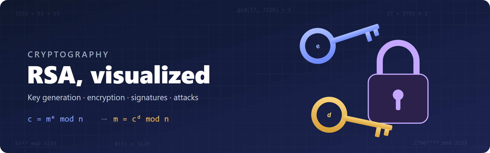
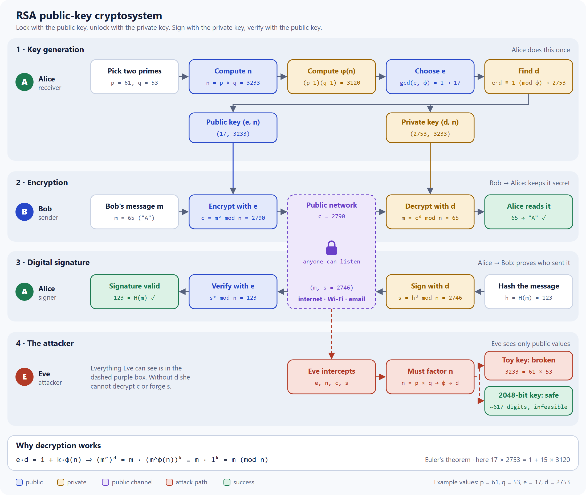

# RSA, visualized



**[▶ Live demo](https://yanshuman.github.io/cryptography/rsa/)** · [Clickable architecture](https://yanshuman.github.io/cryptography/rsa/rsa-architecture.html) · [Back to all projects](../README.md)

RSA is a public-key (asymmetric) encryption algorithm. Anyone can lock a message with the **public key**, but only the owner of the **private key** can unlock it. Its security rests on one fact: multiplying two large primes is easy, but factoring their product back into those primes is practically impossible.

## Architecture

<picture>
  <source media="(prefers-color-scheme: dark)" srcset="images/rsa-architecture-dark.png">
  
</picture>

The diagram follows three people:

- **Alice** (receiver) makes the keys once. She publishes `(e, n)` and keeps `(d, n)` secret.
- **Bob** (sender) encrypts with Alice's public key. Only Alice's private key can decrypt it.
- **Alice** can also *sign* a message with her private key, and anyone can check it with her public key.
- **Eve** (attacker) sees everything on the public network, but without `d` she can neither read nor forge anything. Her only route to `d` is to factor `n`.

There are two other versions of this diagram:

- [`rsa-architecture.html`](rsa-architecture.html): click any box for an explanation, switch theme, and export as SVG or PNG.
- [`rsa-flow.svg`](rsa-flow.svg): a vector version that follows your light or dark theme.

## The algorithm

| Step | What happens | Example |
|---|---|---|
| 1 | Choose two primes p and q | p = 61, q = 53 |
| 2 | n = p × q (public) | 3233 |
| 3 | φ(n) = (p − 1)(q − 1) (private) | 3120 |
| 4 | Choose e with gcd(e, φ(n)) = 1 (public) | 17 |
| 5 | Find d with (e × d) mod φ(n) = 1 (private) | 2753 |
| Encrypt | c = mᵉ mod n | 65¹⁷ mod 3233 = 2790 |
| Decrypt | m = cᵈ mod n | 2790²⁷⁵³ mod 3233 = 65 |
| Sign | s = hᵈ mod n | 123²⁷⁵³ mod 3233 = 2746 |
| Verify | h = sᵉ mod n | 2746¹⁷ mod 3233 = 123 ✓ |

Public key: **(e, n) = (17, 3233)**. Private key: **(d, n) = (2753, 3233)**.

## Why primes?

φ(n) is needed to compute the private key d. When p and q are prime, the owner can calculate φ(n) instantly with (p − 1)(q − 1). An attacker who only sees n would first have to factor it, and for a 2048-bit n (about 617 digits) no known method can do that in any practical time.

## Interactive RSA Lab

[`index.html`](index.html) is a single-page app that walks you through RSA with your own numbers:

1. **Asks for two primes.** If a number is not prime, it shows the factors (60 = 2 × 30) and suggests the nearest primes (59, 61) as one-click buttons.
2. **Builds the keys.** It calculates n, φ(n), e and d live, with the Extended Euclidean Algorithm table used to find d.
3. **Encrypts and decrypts** a number, showing the square-and-multiply working.
4. **Draws your architecture.** The full RSA diagram is redrawn with your numbers. Press ▶ Play to watch the message travel from sender to network to receiver, or download the diagram as SVG.
5. **Encrypts a whole word** letter by letter.
6. **Plays the attacker.** It factors n, recovers the private key, and explains why that fails at real key sizes.

No installation needed. Open the file in any browser, or use the [live demo](https://yanshuman.github.io/cryptography/rsa/).

---

## Questions & Answers

### The basics

<details>
<summary><b>What is the difference between symmetric and asymmetric encryption?</b></summary>

Symmetric encryption (like AES) uses **one shared key** to both lock and unlock, so both sides must somehow agree on that key in secret first. Asymmetric encryption (like RSA) uses **a key pair**: a public key that locks and a private key that unlocks. You can publish the public key openly, which solves the problem of exchanging a secret with someone you have never met.
</details>

<details>
<summary><b>Why does RSA use a public key and a private key?</b></summary>

The public key can be shared openly for encryption or signature checks, while the private key stays secret for decryption or signing. That keeps the trust model simple: nobody ever has to send the secret half anywhere.
</details>

<details>
<summary><b>Why are the example keys so small?</b></summary>

They are intentionally tiny so the math stays readable in a browser and each step is easy to follow. Real RSA keys are 2048 bits or larger and use the same algorithm, plus padding and secure random number generation.
</details>

<details>
<summary><b>What happens if I type a number that is not prime?</b></summary>

The lab tells you why it isn't prime (for example 91 = 7 × 13) and offers the nearest primes as buttons. RSA needs real primes: if p or q has its own factors, φ(n) = (p − 1)(q − 1) is wrong and decryption returns garbage. It also makes n much easier to factor.
</details>

<details>
<summary><b>Why must p and q be different?</b></summary>

If p = q, then n = p², and anyone can take the square root of n to get p instantly. The whole key is broken in one step.
</details>

### The math

<details>
<summary><b>Why does decryption give back the original message?</b></summary>

Because e and d are chosen so that e × d = 1 + k × φ(n) for some whole number k. Then:

```
(mᵉ)ᵈ = m^(1 + k·φ(n)) = m · (m^φ(n))ᵏ ≡ m · 1ᵏ = m   (mod n)
```

The step m^φ(n) ≡ 1 (mod n) is **Euler's theorem**. In the example, 17 × 2753 = 46801 = 1 + 15 × 3120.
</details>

<details>
<summary><b>How is d actually found?</b></summary>

With the **Extended Euclidean Algorithm**. It runs the normal gcd process on φ(n) and e, but also tracks how each remainder can be written as a combination of the two. When the remainder reaches 1, that combination gives the number d with e × d ≡ 1 (mod φ(n)). The lab shows this table step by step.
</details>

<details>
<summary><b>Why can't e share a factor with φ(n)?</b></summary>

If gcd(e, φ(n)) ≠ 1, there is no d with e × d ≡ 1 (mod φ(n)), so the encryption can't be undone. For example, with φ(n) = 3120, e = 3 fails because 3 divides 3120.
</details>

<details>
<summary><b>Why is e almost always 65537 in practice?</b></summary>

65537 = 2¹⁶ + 1 is prime and has only two 1-bits in binary, so encryption with square-and-multiply needs just 17 multiplications. It is large enough to avoid the attacks that work against very small exponents like e = 3, and fast enough for everyday use.
</details>

<details>
<summary><b>How do computers calculate something like 2790²⁷⁵³ without overflowing?</b></summary>

They never compute the full power. **Square-and-multiply** (modular exponentiation) writes the exponent in binary, squares repeatedly, and reduces mod n after every step, so numbers never grow larger than n². Even with a 2048-bit exponent this takes only a few thousand multiplications.
</details>

<details>
<summary><b>What happens if the message m is bigger than n?</b></summary>

Decryption returns m mod n instead of m, so information is lost. The message must be smaller than n. In practice RSA only encrypts short values such as a symmetric key, never long files.
</details>

### Security

<details>
<summary><b>How would an attacker break RSA?</b></summary>

By factoring n back into p and q. With those, they can compute φ(n) and then d exactly as the owner did. For the toy key 3233 = 61 × 53 this takes microseconds. For a 2048-bit n the best known classical algorithm, the General Number Field Sieve, would take far longer than the age of the universe.
</details>

<details>
<summary><b>What is wrong with "textbook" RSA (no padding)?</b></summary>

Textbook RSA, as shown in this project, has real weaknesses:

- **It is deterministic.** The same message always gives the same ciphertext, so an attacker can guess-and-check likely messages.
- **It is malleable.** Multiplying a ciphertext by 2ᵉ mod n makes it decrypt to 2m, without knowing m.
- **Small messages leak.** If mᵉ < n, the "mod" never happens and m is just the e-th root of c.

Real systems add random padding first: **OAEP** for encryption and **PSS** for signatures.
</details>

<details>
<summary><b>How big should an RSA key be today?</b></summary>

At least **2048 bits**. NIST recommends 3072 bits for protection beyond 2030. 1024-bit keys are considered unsafe, and the largest RSA number publicly factored so far is 829 bits (RSA-250, in 2020).
</details>

<details>
<summary><b>What mistakes make real RSA keys weak?</b></summary>

- **Bad randomness.** If two keys share a prime, `gcd(n₁, n₂)` reveals it instantly. Researchers have found thousands of such keys on the internet.
- **p and q too close together.** Fermat's method factors n quickly when √n is near both primes.
- **A small private exponent d.** Wiener's attack recovers d when it is too small.
- **Side channels.** Timing or power measurements during decryption can leak bits of d.
</details>

<details>
<summary><b>Will quantum computers break RSA?</b></summary>

A large enough quantum computer running **Shor's algorithm** could factor n efficiently, which would break RSA completely. No such machine exists today, but because encrypted data can be recorded now and decrypted later, the world is moving to post-quantum algorithms. NIST standardized **ML-KEM** (encryption) and **ML-DSA** (signatures) in 2024 for this reason.
</details>

### In the real world

<details>
<summary><b>How do digital signatures work with RSA?</b></summary>

They run RSA "backwards". Alice hashes her message and raises the hash to her **private** exponent: s = hᵈ mod n. Anyone can check it with her **public** key: if sᵉ mod n equals the hash of the message, the message really came from Alice and wasn't changed. In the example, h = 123 gives s = 2746, and 2746¹⁷ mod 3233 = 123 ✓.
</details>

<details>
<summary><b>If RSA is so secure, why isn't it used to encrypt everything?</b></summary>

It is slow, roughly 1000× slower than AES, and it can only encrypt data smaller than n. Real systems use **hybrid encryption**: RSA (or a key exchange) protects a short random AES key, and AES encrypts the actual data.
</details>

<details>
<summary><b>Where is RSA used today?</b></summary>

- **HTTPS certificates.** Many websites still prove their identity with RSA signatures.
- **SSH keys** for logging into servers (`ssh-keygen -t rsa`).
- **Code and software signing**, so your computer can trust updates.
- **Email encryption** with PGP/GPG and S/MIME.
- **Smart cards, passports and hardware tokens.**

Modern TLS 1.3 uses elliptic-curve Diffie–Hellman to exchange keys, but RSA signatures in certificates remain very common.
</details>

<details>
<summary><b>What is the Chinese Remainder Theorem (CRT) speed-up?</b></summary>

Since the owner knows p and q, they can decrypt mod p and mod q separately with smaller numbers and then combine the two results. That makes decryption about 4× faster, which is why real private keys store p, q, and a few precomputed values, not just d.
</details>

### About this project

<details>
<summary><b>Is this production-ready cryptography?</b></summary>

No. This project is a learning tool for understanding the algorithm and the math behind it. Real-world security should use a well-tested library such as OpenSSL, Python's `cryptography`, or Go's standard crypto packages.
</details>

<details>
<summary><b>Can I run this locally?</b></summary>

Yes. Download or clone the repository and open [`index.html`](index.html) in a browser. You don't need to install a framework or build system.
</details>

<details>
<summary><b>Where can I ask more questions?</b></summary>

Open an issue on GitHub and ask about the project, the math, or improvements: https://github.com/yanshuman/cryptography/issues
</details>

---

---

## How to run

No installation needed. Open [`index.html`](index.html) in any browser (double-click it), or run this from this folder:

```powershell
start index.html
```

## Files

```
rsa/
├── README.md                      # This guide
├── index.html                     # Interactive RSA Lab (prime check, live architecture, attacker)
├── rsa-architecture.html          # Clickable architecture diagram with SVG/PNG export
├── rsa-flow.svg                   # Vector diagram (follows light/dark theme)
└── images/
    ├── rsa-banner.png / .svg      # Banner
    ├── rsa-architecture-light.png # Architecture image (light)
    └── rsa-architecture-dark.png  # Architecture image (dark)
```

## Note

This project uses small primes for learning. Real systems must use large random primes (2048 bits or more), proper padding such as OAEP, and a well-tested crypto library rather than hand-written RSA.
